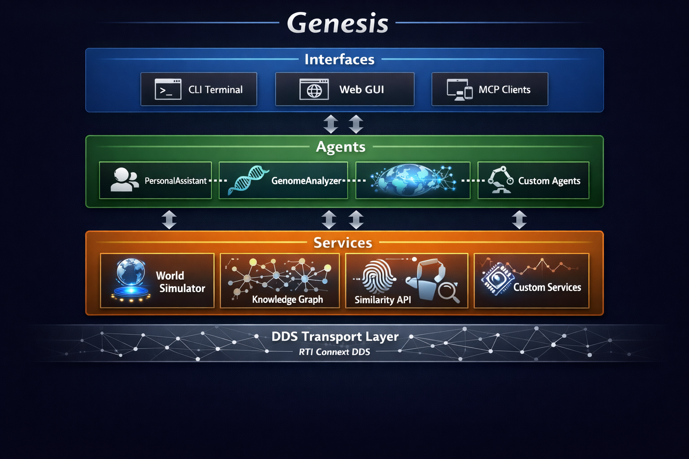

# GENESIS - Distributed AI Agent Framework

[](https://www.python.org/downloads/)
[](https://www.rti.com/)
[](LICENSE)
[]()
[](https://github.com/rticommunity/rti-genesis/wiki)

**GENESIS** (Generative Networked System for Intelligent Services) is a Python framework for building distributed AI agent networks with the robustness and reliability required for production deployments.

---

## 📑 Table of Contents

- [What You Get](#-what-you-get)
- [Quick Example](#-quick-example)
- [Installation](#-installation)
- [Try the Demo](#-try-the-demo)
- [Key Features](#-key-features)
- [Architecture](#️-architecture)
- [Examples](#-examples)
- [Documentation](#-documentation)
- [Use Cases](#-use-cases)
- [Technical Requirements](#️-technical-requirements)
- [Contributing](#-contributing)
- [Support](#-support)
- [License](#-license)

---

## 🎯 What You Get

### **Zero-Configuration Discovery**
Agents and services find each other automatically—**no IP addresses, no ports, no configuration files**:

```python
# Terminal 1: Start a service
service = CalculatorService()
await service.run()

# Terminal 2: Start an agent (on any machine)
agent = MathAgent()
# Agent instantly discovers Calculator—no config needed
```

Works across machines, networks, and even cloud regions. Just start your components and they find each other.

### **Production-Grade Reliability**
Built on **RTI Connext DDS**—the same middleware powering:

- ✈️ Flight control systems and unmanned vehicles
- 🏥 FDA-cleared surgical robots
- 🚗 Autonomous vehicle sensor fusion
- ⚡ Power grid SCADA systems
- 🏭 Factory automation at scale

When your AI system needs to work every time, GENESIS inherits battle-tested infrastructure from domains where failure is not an option.

### **Intelligent Function Windowing**
Don't overwhelm your LLM with 200 functions—**classifiers automatically select the 5-10 relevant ones**:

```python
# System discovers 200+ functions
# Classifier windows to relevant subset
classifier.classify_functions(
    query="calculate compound interest",
    functions=all_discovered_functions
)
# LLM sees only: [calculate_interest, compound_rate, ...]
```

**Result**: 90%+ reduction in LLM tokens, faster responses, better accuracy.

### **Fine-Grained Control**
Configure exactly how your data flows:

- **Reliability**: Best-effort (fast) or guaranteed delivery
- **Durability**: Volatile or persistent data (survives restarts)
- **Content Filtering**: Subscribers get only what they need
- **Security**: Authentication, encryption, access control (via DDS Security plugins—planned)

### **True Peer-to-Peer**
No central broker to become a bottleneck or single point of failure. Agents communicate directly with sub-millisecond latency.

---

## ✨ Key Features

| Feature | Description |
|---------|-------------|
| 🔍 **DDS-Based Discovery** | Automatic discovery inherited from DDS—no configuration |
| 📊 **Intelligent Windowing** | Classifiers reduce LLM token usage by 90%+ |
| 💾 **Memory Management** | Context preservation with token limit awareness |
| 🤖 **Multi-LLM Support** | OpenAI, Anthropic—add new providers in ~150 lines |
| 🔗 **Agent-as-Tool Pattern** | Agents call other agents via LLM tool interface |
| 🛠️ **Decorator-Based Development** | `@genesis_tool` and `@genesis_function` decorators |
| ⚡ **Real-Time Performance** | Sub-millisecond DDS communication |
| 🌐 **Peer-to-Peer Architecture** | No central broker—DDS handles routing |
| 🔐 **Security-Ready** | DDS Security plugin support (planned) |
| 📡 **Pub/Sub Control** | Content filtering and QoS policies via DDS |

---

## 🎯 Quick Example

### Create a Service (30 seconds)

```python
from genesis_lib.monitored_service import MonitoredService
from genesis_lib.decorators import genesis_function

class CalculatorService(MonitoredService):
    def __init__(self):
        super().__init__("Calculator", capabilities=["math"])
        self._advertise_functions()
    
    @genesis_function()
    async def add(self, x: float, y: float) -> dict:
        """Add two numbers."""
        return {"result": x + y}

# Run it—DDS handles discovery
service = CalculatorService()
await service.run()
```

### Create an Agent (30 seconds)

```python
from genesis_lib.openai_genesis_agent import OpenAIGenesisAgent

class MathAgent(OpenAIGenesisAgent):
    def __init__(self):
        super().__init__(
            model_name="gpt-4o",
            agent_name="MathAssistant"
        )

# Run it—agent discovers services, classifiers window relevant functions
agent = MathAgent()
response = await agent.process_message("What is 2 + 2?")
# Classifier determines Calculator.add is relevant
# Agent calls function via DDS
```

---

## 📦 Installation

### Prerequisites

1. **Python 3.10** (required)
2. **RTI Connext DDS 7.3.0+** (see below)
3. **API Keys** (OpenAI or Anthropic)

### Getting RTI Connext DDS

GENESIS requires RTI Connext DDS. RTI offers several free options:

| License Type | Best For | Limits |
|--------------|----------|--------|
| **[60-Day Evaluation](https://www.rti.com/get-connext)** | Exploring GENESIS, building prototypes | Unlimited scale, time-limited |
| **[Connext Express](https://www.rti.com/get-connext)** | Small deployments, getting started | Free forever, participant-limited |
| **[University Program](https://www.rti.com/developers/university-program)** | Researchers, academics, classrooms | Perpetual research licenses |

> 💡 **Recommendation**: Start with the **60-day evaluation** for full functionality. If you're building networks with multiple agents/services, avoid the Express license (participant-limited). Researchers should apply for the University Program for perpetual access.

### Quick Install

```bash
# Clone repository (or download release)
cd Genesis_LIB

# Automated setup (recommended)
./setup.sh

# Manual setup alternative
python3.10 -m venv venv
source venv/bin/activate
pip install -e .
```

### Environment Setup

```bash
# RTI Connext DDS
export NDDSHOME="/path/to/rti_connext_dds-7.3.0"

# API Keys
export OPENAI_API_KEY="your_openai_key"
export ANTHROPIC_API_KEY="your_anthropic_key"
```

📖 **Detailed instructions**: See [INSTALL.md](INSTALL.md) and [QUICKSTART.md](QUICKSTART.md)

---

## 🎬 Try the Demo

Experience GENESIS capabilities with a multi-agent example:

```bash
# Run the MultiAgent demo
cd examples/MultiAgent
./run_interactive_demo.sh
```

**What you'll see:**
- ✅ DDS-based automatic discovery
- ✅ Agent-to-agent delegation (PersonalAssistant → WeatherAgent)
- ✅ Function classification and windowing
- ✅ Real API integration (OpenWeatherMap)
- ✅ Real-time monitoring via DDS topics

---

## 🏗️ Architecture

GENESIS uses a three-layer architecture that separates concerns and enables multi-provider support:



```
┌─────────────────────────────────────────────────────────┐
│ ProviderAgent (OpenAI, Anthropic, etc.)                │
│ - Provider-specific API calls                          │
│ - Message format conversion                            │
└─────────────────────────────────────────────────────────┘
                          ▲
                          │ inherits
┌─────────────────────────────────────────────────────────┐
│ MonitoredAgent                                          │
│ - State management (DISCOVERING → READY → BUSY)        │
│ - Graph topology publishing                            │
│ - Event tracking and monitoring                        │
└─────────────────────────────────────────────────────────┘
                          ▲
                          │ inherits
┌─────────────────────────────────────────────────────────┐
│ GenesisAgent                                            │
│ - Provider-agnostic discovery                          │
│ - Tool routing and execution                           │
│ - Multi-turn orchestration                             │
└─────────────────────────────────────────────────────────┘
```

**DDS Communication Layer** provides:
- Automatic discovery via `Advertisement` topic
- Request/Reply for RPC calls
- Pub/Sub for monitoring and events
- QoS-configurable reliability and performance

📖 **Full documentation**: [docs/](docs/)

---

## 📚 Documentation

| Document | Description |
|----------|-------------|
| [**Wiki**](https://github.com/rticommunity/rti-genesis/wiki) | Comprehensive guides, API reference, and FAQ |
| [QUICKSTART.md](QUICKSTART.md) | Get up and running in 5 minutes |
| [INSTALL.md](INSTALL.md) | Detailed installation instructions |
| [docs/](docs/) | Technical documentation (architecture, internals) |

📖 **Start here**: [Wiki Home](https://github.com/rticommunity/rti-genesis/wiki) for guides and tutorials

---

## 🎓 Examples

| Example | Description | Location |
|---------|-------------|----------|
| **Hello World** | Minimal agent + service + interface | `examples/HelloWorld/` |
| **MultiAgent** | Agent-as-tool pattern with real APIs | `examples/MultiAgent/` |
| **Graph Interface** | Chat + real-time network visualization | `examples/GraphInterface/` |
| **Standalone Graph Viewer** | Pure network visualization server | `examples/StandaloneGraphViewer/` |
| **Example Interface** | Basic interface patterns | `examples/ExampleInterface/` |

---

## 🌟 Use Cases

### **Critical Infrastructure AI**
Leverage DDS's proven reliability for AI systems requiring high availability and determinism.

### **Distributed AI Pipelines**
Chain agents and services across machines using DDS's scalable pub/sub architecture.

### **Real-Time AI Applications**
Sub-millisecond DDS communication for robotics, IoT, and edge AI requiring low latency.

### **Enterprise AI Integration**
Connect legacy systems with AI agents using DDS's platform-independent middleware.

### **Large-Scale Agent Networks**
Deploy hundreds of agents with DDS's proven scalability (tested in systems with thousands of nodes).

---

## 🤝 Contributing

We welcome contributions! Here's how to get started:

1. **Fork the repository**
2. **Create a feature branch**: `git checkout -b feature/my-feature`
3. **Make your changes**
4. **Run tests**: `./tests/run_all_tests.sh`
5. **Submit a pull request**

📖 **Testing guide**: [tests/README.md](tests/README.md)

### **Development Setup**

```bash
# Clone and setup (or download release)
cd Genesis_LIB
./setup.sh

# Activate environment
source venv/bin/activate

# Install in editable mode
pip install -e .

# Run tests
cd tests && ./run_all_tests.sh
```

---

## 🛠️ Technical Requirements

| Component | Requirement |
|-----------|-------------|
| **Python** | 3.10 (required) |
| **RTI Connext DDS** | 7.3.0 or greater |
| **Operating System** | macOS, Linux, Windows |
| **LLM APIs** | OpenAI and/or Anthropic |

---

## 📞 Support

Need help? We're here for you.

**Email**: [genesis@rti.com](mailto:genesis@rti.com?subject=Genesis%20Support%20Request)

When contacting support, please include:
- **Subject line**: "Genesis: [brief description]"
- **Environment**: OS, Python version, RTI Connext version
- **Description**: What you're trying to do and what's happening
- **Logs/errors**: Any relevant error messages or stack traces

For bug reports, you can also [open a GitHub Issue](../../issues).

---

## 📄 License

GENESIS is released under the RTI License. See [LICENSE](LICENSE) for details.

---

<div align="center">

**Built with ❤️ by the GENESIS Team**

[Wiki](https://github.com/rticommunity/rti-genesis/wiki) • [Documentation](docs/) • [Examples](examples/) • [Report Issues](../../issues)

</div>

---

*(c) 2025 Copyright, Real-Time Innovations, Inc. (RTI) All rights reserved.*

*RTI grants Licensee a license to use, modify, compile, and create derivative works of the Software. Licensee has the right to distribute object form only for use with RTI products. The Software is provided "as is", with no warranty of any type, including any warranty for fitness for any purpose. RTI is under no obligation to maintain or support the Software. RTI shall not be liable for any incidental or consequential damages arising out of the use or inability to use the software.*
