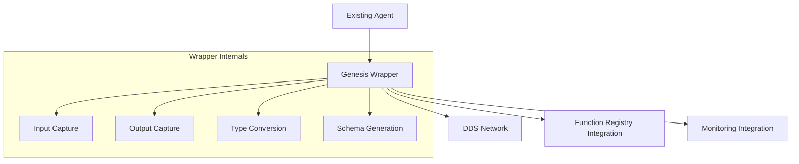
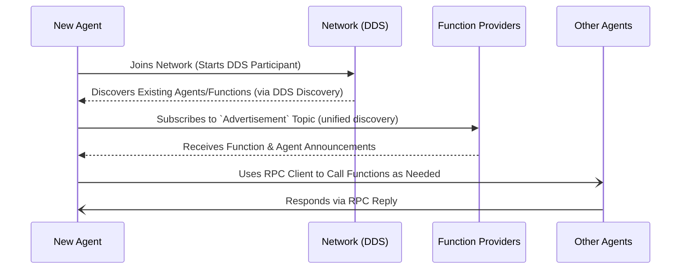
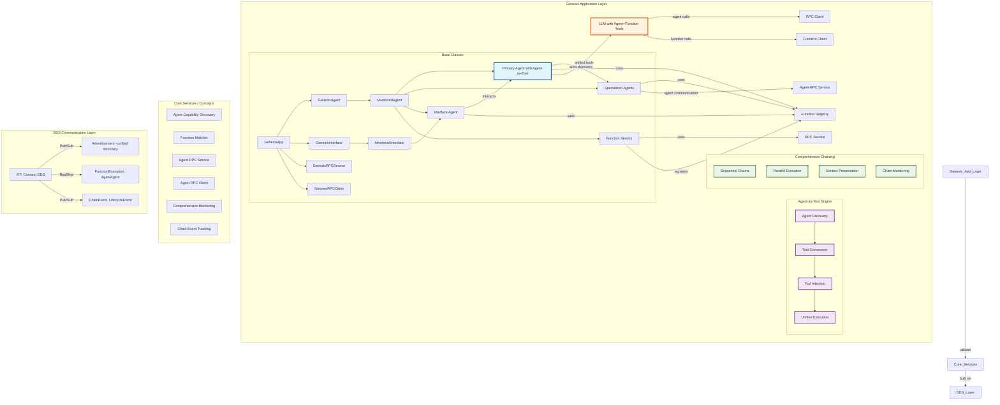
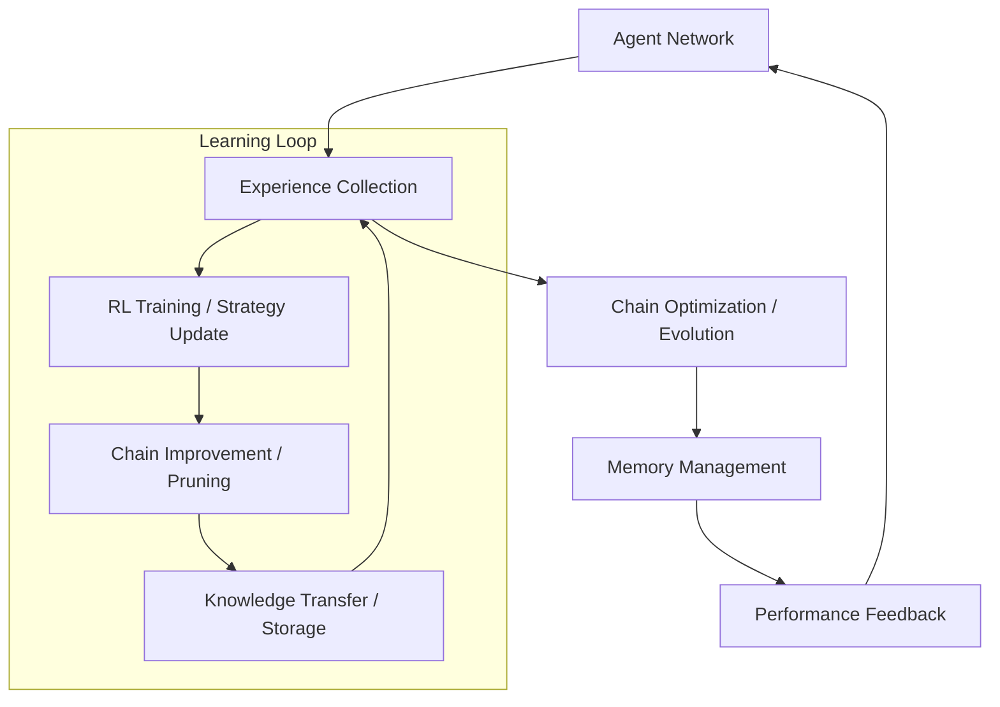
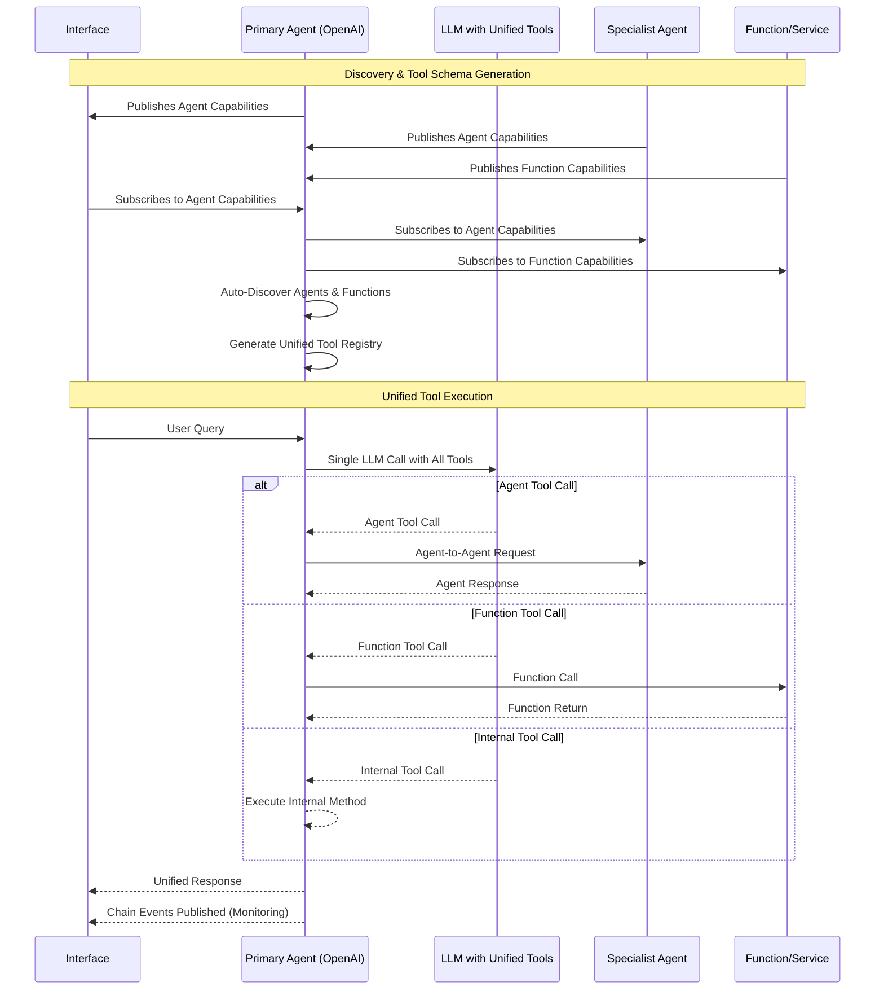

# GENESIS \- A Distributed AI Agent Framework

## Overview

GENESIS (Generative Networked System for Intelligent Services) is a Python library designed for building complex, distributed AI agent networks. It facilitates seamless communication, dynamic function discovery, and collaboration between heterogeneous AI agents, leveraging the power of **RTI Connext DDS** for real-time, reliable, and scalable interactions.

## Project Status

### Current Phase: Phase 5 - COMPLETE ✅

**Overall Progress: 100% Complete**

#### ✅ Completed Phases:
- **Phase 1-4**: Core framework, monitoring, and infrastructure (100% complete)
- **Phase 5A**: Weather Agent with LLM integration (100% complete)
- **Phase 5B**: Basic multi-agent communication (100% complete)
- **Phase 5C**: Comprehensive chaining tests with agent-as-tool pattern (100% complete)

#### 🎉 PHASE 5C ACHIEVEMENTS:
1. **Agent-as-Tool Pattern**: ✅ Agents automatically injected as LLM tools
2. **Comprehensive Chain Testing**: ✅ All three chain patterns implemented and tested
   - **Sequential Chains**: Interface → Agent A → Agent B → Service → Function
   - **Parallel Execution**: Interface → Agent → Multiple Agents (parallel) → Multiple Services
   - **Context Preservation**: Interface → Agent → Agent (context) → Agent → Service
3. **Real API Integration**: ✅ All tests use real APIs (OpenAI, OpenWeatherMap, etc.) with NO mock data
4. **Universal Tool Schema**: ✅ Agents discovered and converted to OpenAI tools automatically
5. **Performance Validation**: ✅ Latency, concurrency, and context preservation metrics validated

**Phase 5 SUCCESS**: ALL final tests pass with real APIs, comprehensive monitoring, and zero mock data.

See `examples/MultiAgent/` for complete working demonstrations of agent-as-tool patterns and chaining.

## Quick Start

### Prerequisites

Before setting up Genesis LIB, ensure you have:

1. **Python 3.10**
   - We recommend using `pyenv` to manage Python versions
   - Installation instructions for pyenv:
     ```bash
     # macOS
     brew install pyenv
     
     # Linux
     curl https://pyenv.run | bash
     
     # Add to your shell configuration
     echo 'export PYENV_ROOT="$HOME/.pyenv"' >> ~/.bash_profile
     echo 'command -v pyenv >/dev/null || export PATH="$PYENV_ROOT/bin:$PATH"' >> ~/.bash_profile
     echo 'eval "$(pyenv init -)"' >> ~/.bash_profile
     
     # Install Python 3.10
     pyenv install 3.10.0
     pyenv global 3.10.0
     ```

2. **RTI Connext DDS 7.3.0 or greater**
   - Download from [RTI's website](https://support.rti.com/downloads)
   - Install in one of the following locations:
     - macOS: `/path/to/rti_connext_dds-7.3.0`
     - Linux: `/path/to/rti_connext_dds-7.3.0` or `$HOME/rti_connext_dds-7.3.0`
     - Windows: `C:\path\to\rti_connext_dds-7.3.0`

3. **API Keys**
   - OpenAI API Key (for GPT models)
   - Anthropic API Key (for Claude models)
   - Store these in your environment or `.env` file:
     ```bash
     export OPENAI_API_KEY="your_openai_api_key"
     export ANTHROPIC_API_KEY="your_anthropic_api_key"
     ```

### Quick Setup

The easiest way to set up Genesis LIB is to use the provided setup script:

```bash
# Clone the repository
git clone https://github.com/your-org/Genesis_LIB.git
cd Genesis_LIB

# Run the setup script
./setup.sh
```

The setup script will:
1. Create a Python virtual environment
2. Install all required dependencies
3. Configure RTI Connext DDS environment
4. Set up API keys
5. Install the package in development mode

### Try the Revolutionary MultiAgent Example

After setup, experience GENESIS's breakthrough agent-as-tool pattern with the comprehensive MultiAgent demonstration:

```bash
# Run the revolutionary MultiAgent example
cd examples/MultiAgent
./run_interactive_demo.sh
```

This demo showcases GENESIS's revolutionary capabilities:
- **Agent-as-Tool Pattern**: PersonalAssistant automatically discovers WeatherAgent and converts it to an OpenAI tool
- **Real Agent-to-Agent Communication**: Seamless delegation between agents via DDS
- **@genesis_tool Auto-Discovery**: Zero-boilerplate tool development with automatic schema generation
- **Real API Integration**: Live OpenWeatherMap and OpenAI API integration (no mock data)
- **Comprehensive Chaining**: Sequential chains, parallel execution, and context preservation
- **Real-Time Monitoring**: Complete visibility into multi-agent workflows

**Example Interaction:**
```
You: "What's the weather in Tokyo?"
→ PersonalAssistant LLM sees: [get_weather_info, add_numbers, multiply, ...]
→ LLM calls: get_weather_info(message="Tokyo weather")
→ Automatically routed to WeatherAgent via DDS
→ WeatherAgent calls real OpenWeatherMap API
→ Real weather data returned through the chain
```

### Additional Examples

For simpler demonstrations:

```bash
# Run the Hello World example (basic function calling)
cd examples/HelloWorld
./run_hello_world.sh

# Run comprehensive test suite (all chain patterns)
cd run_scripts
python comprehensive_multi_agent_test_interface.py
```

### Next Steps

Once you've verified your installation with the Hello World example, you can:
1. Explore the examples directory for more complex use cases
2. Read the detailed documentation below
3. Start building your own agents and services

The core purpose of GENESIS is to enable the creation of sophisticated multi-agent systems where different agents, potentially built using various AI frameworks (like LangChain, OpenAI's API, or native Python), can work together to solve problems that are beyond the capability of any single agent.

## Why an Agent-to-Agent Framework like GENESIS?

Modern AI applications often require the coordination of multiple specialized components:

* **LLMs:** For natural language understanding, generation, and reasoning.  
* **Planning Agents:** To decompose complex tasks.  
* **Perception Models:** To interpret sensory data.  
* **Domain-Specific Tools:** Databases, simulators, external APIs.

Connecting these components ad-hoc using simple methods like direct sockets or basic REST APIs quickly becomes complex and brittle. Key challenges include:

1. **Discovery:** How do agents find each other and the capabilities they offer?  
2. **Reliability:** How to ensure messages are delivered, especially in dynamic or unreliable networks?  
3. **Scalability:** How to handle communication efficiently as the number of agents and interactions grows?  
4. **Data Typing:** How to ensure data consistency between different agents?  
5. **Real-time Needs:** How to support low-latency interactions required for certain applications?  
6. **Heterogeneity:** How to integrate agents built with different technologies or frameworks?

GENESIS addresses these challenges by providing a structured framework built on DDS.

## Philosophy: Automated Agent Connection

GENESIS is built on the philosophy that agent networks should be self-organizing and self-configuring. Rather than requiring users to manually define connections between agents, GENESIS automates the entire process of agent discovery, connection, and collaboration.

### Key Principles

1. **Zero-Configuration Discovery:** Agents automatically discover each other through DDS without manual configuration of IPs/ports, adapting dynamically.  
2. **Self-Organizing Networks:** Connections form based on capabilities, allowing network topology to emerge organically without central orchestration.  
3. **Intelligent Function Matching:** Functions are classified and matched to requests dynamically, enabling agents to use newly available capabilities.  
4. **Automatic Load Balancing:** Multiple instances of functions are discovered, allowing requests to be distributed, adapting to provider availability.

### Genesis Wrapper: Seamless Integration

A key component of this automation philosophy is the planned **Genesis Wrapper** system. This system will allow existing agents to be integrated into Genesis *without any code changes*.



**How it Works:**

1. **Input/Output Capture:** Monitors agent streams to capture calls/responses.  
2. **Automatic Integration:** Handles all DDS communication transparently.  
3. **Schema Generation:** Analyzes I/O patterns to create DDS types and function descriptions.  
4. **Monitoring Integration:** Adds health/performance tracking automatically.

**Example Usage (Conceptual):**

```py
# Example of wrapping an existing agent (Conceptual)
from genesis_lib import GenesisWrapper

# Create wrapper for existing agent
wrapper = GenesisWrapper(
    agent=existing_agent,
    input_method="process_input",  # Method to capture inputs
    output_method="get_response",  # Method to capture outputs
    name="wrapped_agent"           # Name in Genesis network
)

# Start the wrapped agent
wrapper.start()
# Agent is now discoverable and usable within the Genesis network.
```

**Benefits:**

* **Zero-Code Integration:** Integrates legacy or existing systems quickly.  
* **Automatic Discovery:** Wrapped agents join and advertise functions seamlessly.  
* **Seamless Operation:** Preserves original agent behavior.  
* **Enhanced Capabilities:** Gains monitoring, load balancing potential, etc.

This wrapper system exemplifies Genesis's commitment to automation and ease of use.

### Example: Automated Connection Flow



### Benefits of Automation

1. **Reduced Complexity:** Eliminates manual connection management.  
2. **Increased Reliability:** Automatic discovery and potential for reconnection.  
3. **Enhanced Scalability:** Easily add/remove agents and functions.  
4. **Improved Flexibility:** Adapt to changing requirements and network topology.

## System Architecture

GENESIS employs a revolutionary modular architecture built upon RTI Connext DDS with breakthrough agent-as-tool integration.



**Key Revolutionary Components:**

* **Agent-as-Tool Engine:** The breakthrough feature that automatically:  
  * **Discovers** agents through unified `Advertisement` topic (kind=AGENT)  
  * **Converts** agent capabilities to OpenAI tool schemas using universal patterns  
  * **Injects** agent tools alongside function tools in single LLM calls  
  * **Executes** agent tool calls via seamless DDS agent-to-agent communication  

* **Primary Agent with Agent-as-Tool:** Enhanced `OpenAIGenesisAgent` that:  
  * Maintains both function and agent tool registries  
  * Provides unified tool schemas to LLM (functions + agents + internal tools)  
  * Routes tool calls to appropriate targets (functions or agents)  
  * Preserves full context and conversation state across chains  

* **Comprehensive Chaining Engine:** Complete support for:  
  * **Sequential Chains:** `Interface → Agent A → Agent B → Service → Function`  
  * **Parallel Execution:** `Interface → Agent → [Agent A, Agent B, Agent C] → Services`  
  * **Context Preservation:** Multi-hop chains maintaining conversation context  
  * **Real-Time Monitoring:** Every hop tracked with performance metrics  

* **Enhanced Agent Communication:** Beyond basic RPC:  
  * **AgentAgentRequest/Reply:** Structured agent-to-agent communication  
  * **Context Preservation:** `conversation_id` maintained across hops  
  * **Performance Tracking:** Latency and success metrics for each hop  
  * **Error Propagation:** Graceful failure handling through chains  

* **Universal Discovery System:** Unified discovery via single `Advertisement` topic:  
  * **Function Discovery:** Via `Advertisement` (kind=FUNCTION) with rich metadata  
  * **Agent Discovery:** Via `Advertisement` (kind=AGENT) with specializations and capabilities  
  * **Single Topic Architecture:** One durable topic for all discovery (47% topic reduction)  
  * **Capability-Based Matching:** Tools named by functionality, not agent names  
  * **Dynamic Registration:** Hot-pluggable agents and functions  

**Interaction Flow:**

1. **Discovery Phase:** Agents and services start, initialize DDS, begin enhanced discovery with rich metadata.  
2. **Tool Generation:** Primary agents discover others and auto-generate tool schemas based on capabilities.  
3. **Unified Tool Integration:** LLM receives combined tool schemas (functions + agents + internal tools).  
4. **Intelligent Execution:** LLM selects appropriate tools; calls routed automatically to agents or functions.  
5. **Chain Execution:** Complex multi-hop workflows execute with full context preservation.  
6. **Comprehensive Monitoring:** All interactions tracked via `ChainEvent` and `ComponentLifecycleEvent` topics.  
7. **Real-Time Visibility:** Monitoring systems provide complete chain visibility and performance metrics.

## Internal Communication Identifiers

GENESIS components are identified by globally unique identifiers (GUIDs) automatically assigned by DDS (e.g., `0101f2a4a246e5cf70e2629680000002`). These GUIDs enable precise targeting and tracking:

* **Discovery:** Genesis logs GUIDs upon discovery:

```
Advertisement subscription matched with remote GUID: 0101f2a4a246e5cf70e2629680000002
Advertisement subscription matched with self GUID:   010193af524e12b65bd4c08980000002
```

* **Function Association:** Provider-client relationships are logged:

```
DEBUG: CLIENT side processing function_id=569fb375-1c98-40c7-ac12-c6f8ae9b3854,
       provider=0101f2a4a246e5cf70e2629680000002,
       client=010193af524e12b65bd4c08980000002
```

* **Benefits:** Unambiguous identification, availability tracking, clear function provider association, potential for identity-based access control.

## Key Features & "Special Sauce"

* **DDS-Powered Communication:** Utilizes RTI Connext DDS for:  
    
  * **Publish/Subscribe:** For unified discovery (`Advertisement`), monitoring (`MonitoringEvent`, etc.), and data streaming.  
  * **Request/Reply (RPC):** For reliable remote procedure calls (`FunctionExecutionRequest`/`Reply`, `AgentAgentRequest`/`Reply`).  
  * **Automatic Discovery:** Built-in mechanism for agents/services to find each other via single consolidated topic.  
  * **Quality of Service (QoS):** Fine-grained control (reliability, durability, latency, etc.) configurable via XML profiles for different topics (e.g., reliable/durable discovery, reliable/volatile RPC, best-effort monitoring).  
  * **Real-time Performance:** Optimized for low-latency, high-throughput.  
  * **Platform Independence:** Supports various platforms (Genesis focuses on Python).


* **DDS Network Transport and Protocol Details:** GENESIS leverages DDS's transport flexibility:  
    
  * **UDPv4/UDPv6:** Default for LAN/WAN, efficient multicast discovery (port 7400), configurable RTPS reliability (heartbeats, ACKs).  
  * **Shared Memory:** Automatic zero-copy transport for inter-process communication on the same host (μs latency, high throughput).  
  * **TCP:** Option for WANs or firewall traversal (port 7400, configurable), supports TLS.  
  * **Automatic Selection:** DDS chooses the best transport based on endpoint location (SHMEM \-\> UDP \-\> TCP).  
  * **Network Usage:** Efficient CDR serialization, configurable batching, predictable discovery traffic overhead.


* **Revolutionary Agent-as-Tool Pattern:** GENESIS 2.0's breakthrough feature:  
    
  * **Automatic Agent Discovery:** Agents automatically discover each other through unified `Advertisement` topic (kind=AGENT) with rich metadata (specializations, capabilities, performance metrics).  
  * **Universal Tool Schema:** Discovered agents are automatically converted to OpenAI tool schemas using a universal pattern - no manual schema definition required.  
  * **Capability-Based Tool Names:** Tools generated based on agent specializations and capabilities (e.g., `get_weather_info`, `use_financial_service`) rather than agent names.  
  * **Single LLM Call Integration:** Agents appear alongside functions in OpenAI tool calls, eliminating the need for separate agent classification stages.  
  * **Seamless Tool Execution:** Agent tool calls are automatically routed via DDS agent-to-agent communication, maintaining full context and monitoring.


* **Comprehensive Multi-Agent Chaining:** Complete support for complex agent workflows:  
    
  * **Sequential Chains:** `Interface → Agent A → Agent B → Service → Function` with full context preservation and monitoring.  
  * **Parallel Execution:** `Interface → Agent → Multiple Agents (parallel) → Multiple Services` with automatic result aggregation.  
  * **Context-Preserving Chains:** `Interface → Agent → Agent (context) → Agent → Service` maintaining conversation context across multiple hops.  
  * **Real-Time Chain Monitoring:** Every hop tracked via `ChainEvent` topics with performance metrics and error propagation.  
  * **Automatic Load Balancing:** Multiple agent instances discovered and utilized for optimal performance.


* **Dynamic Function Discovery & Injection:**  
    
  * Agents advertise Functions via unified `Advertisement` topic (kind=FUNCTION) with standardized schemas.  
  * Agents discover functions dynamically at runtime (`function_discovery.py`).  
  * **LLM-based classification** (`agent_function_injection.md`) to intelligently match requests to capabilities.  
  * Discovered functions automatically "injected" into LLM prompts/contexts alongside agent tools.


* **LLM Integration and AI Framework Support:**  
    
  * **Native Integrations:** Direct API support for OpenAI (GPT series), Anthropic (Claude series), and integration capabilities for Llama, Mistral, HuggingFace models (via local inference or API).  
  * **Optimized LLM Usage:**  
    * *Universal Tool Integration:* Automatic conversion of both functions and agents into LLM tool schemas.  
    * *Context Window Management:* Automatic token counting, truncation strategies, dynamic compression.  
    * *Hybrid Inference:* Combine local and remote models, potentially routing based on task complexity or cost.  
  * **AI Framework Compatibility:** Adapters and integrations available for LangChain, AutoGen, LlamaIndex, HuggingFace Transformers. Custom agents integrated via the `GenesisWrapper`. Example LangChain integration:

```py
from genesis_lib.adapters import LangChainGenesisAdapter
# ... LangChain agent setup ...
genesis_agent = LangChainGenesisAdapter(
    agent_executor=executor, name="math_agent", description="Solves math problems",
    register_tools_as_functions=True # Expose LangChain tools as Genesis functions
)
await genesis_agent.run() # Agent joins Genesis network
```

  * **Deployment Options:** Supports Cloud APIs, Local Inference (ggml, ONNX, llama.cpp), Self-hosted APIs (TGI, vLLM), Hybrid, and Containerized deployments.


* **@genesis_tool Decorator System:** Revolutionary zero-boilerplate tool development:  
    
  * **Automatic Schema Generation:** Python type hints automatically converted to OpenAI tool schemas.  
  * **Zero Manual JSON:** No manual OpenAI function schema definition required.  
  * **Type-Safe Development:** Full Python type safety with automatic validation.  
  * **Seamless Integration:** Decorated methods automatically available in LLM tool calls.


* **Agent-Framework Agnostic:** Designed to integrate agents regardless of implementation (Python/DDS required). Base classes provided, `GenesisWrapper` planned for zero-code integration.  
    
* **Built-in Monitoring:** `MonitoredAgent` publishes lifecycle, communication, status, and log events (`ComponentLifecycleEvent`, `ChainEvent`, `MonitoringEvent`, `LivelinessUpdate`, `LogMessage`) over DDS. Monitoring tools (`genesis_monitor.py`, `genesis_web_monitor.py`) provide comprehensive visibility into multi-agent chains.  
    
* **Structured RPC Framework:** Base classes (`GenesisRPCService`, `GenesisRPCClient`) for robust RPC with schema validation (jsonschema), error handling, and request/reply management.

## Advantages Over Alternatives

| Feature | GENESIS (with DDS) | Direct Sockets | REST APIs | Message Queues (e.g., RabbitMQ/Kafka) | Agent Frameworks (LangChain, etc.) |
| :---- | :---- | :---- | :---- | :---- | :---- |
| **Discovery** | Automatic, built-in (DDS Discovery) | Manual config or separate service registry needed | Separate service registry needed | Broker handles connections, topics needed | Framework-specific, often limited |
| **Communication** | Pub/Sub, Req/Rep, Peer-to-Peer | Point-to-Point stream | Client-Server, Request-Response | Broker-mediated Pub/Sub, Queues | Often HTTP-based or proprietary |
| **Reliability** | Configurable (Best-Effort, Reliable) via DDS QoS | Manual implementation (ACKs, retries) needed | Based on underlying TCP, retries needed | Configurable (ACKs, persistence) | Framework-dependent, often basic |
| **Scalability** | High (DDS designed for large, dynamic systems) | Limited by connection count/management | Limited by server capacity, load balancers needed | High (designed for throughput) | Varies by framework, often limited |
| **Data Typing** | Strong (DDS IDL or Dynamic Types), Schema Validation | Raw bytes, manual serialization/validation needed | Typically JSON/XML, schema validation optional | Broker agnostic (bytes), client handles | Typically JSON-based, limited validation |
| **Real-time** | Yes (Low latency, high throughput) | Possible, depends on implementation | Generally higher latency (HTTP overhead) | Latency varies by broker/config | Generally not optimized for real-time |
| **QoS Control** | Extensive (Reliability, Durability, Latency, etc.) | None built-in | Limited (via HTTP headers, if supported) | Some (Persistence, ACKs) | Limited or non-existent |
| **Function Discovery** | Built-in with metadata, dynamic discovery | Must be implemented manually | Typically requires API documentation/registration | Requires custom implementation | Framework-specific, often limited |
| **Monitoring** | Comprehensive built-in (lifecycle, events, performance) | Manual implementation required | Often requires separate monitoring systems | Varies by broker, often basic | Framework-dependent, often limited |
| **Peer-to-Peer** | Native support | Possible, but discovery/connection management | Possible via complex patterns, not typical | Broker-mediated (not direct P2P) | Rarely supported natively |
| **Filtering** | Data-centric (Content/Time filters in DDS) | Application-level implementation required | Limited (API endpoint parameters) | Topic-based, some header filtering | Application-level implementation required |
| **Security** | Comprehensive (AuthN, AuthZ, Encrypt) via DDS Security | Manual implementation required | TLS/SSL encryption, app-level AuthN/AuthZ | Varies (TLS, SASL, ACLs) | Varies, often basic or external |

## Core Concepts & Technical Details

### Configuration Management

* **DDS Configuration (XML):** Primary method via QoS Profiles XML files defining QoS, resource limits, transports, discovery peers, and optionally types (`datamodel.xml`). Loaded by `GenesisApp`.  
* **Application Configuration:** Environment Variables (`NDDSHOME`, API keys), Config Files (YAML, .env using `python-dotenv`, etc.), Command-line Arguments.  
* **Genesis Component Configuration:** Constructor arguments, programmatic settings within the code.

### State Management

GENESIS is flexible; state is managed at the agent/service level:

* **Agent Internal State:** Managed within Python class instances (e.g., conversation history).  
* **Stateless Functions:** RPC Services often designed stateless for scalability.  
* **DDS for Shared State (Durability):** DDS Durability QoS (`TRANSIENT_LOCAL`, `PERSISTENT`) can share state (e.g., `Advertisement`, shared world model) across agents or with late joiners.  
* **External Databases/Stores:** Agents can integrate with external DBs for complex persistence.

### Error Handling and Resilience

Combines DDS features and application logic:

* **DDS Reliability QoS:** `RELIABLE` QoS handles transient network issues via retransmissions.  
* **DDS Liveliness QoS:** Detects unresponsive components via heartbeats, notifying participants. `LivelinessUpdate` topic provides visibility.  
* **Timeouts:** Configurable in `GenesisRPCClient`, DDS WaitSets, and DDS request-reply operations.  
* **Deadlines:** DDS Deadline QoS ensures periodic data flow.  
* **Application-Level Handling:** RPC replies include `success`/`error_message`. Use `try...except` blocks. Consider Circuit Breakers.  
* **Redundancy:** Multiple instances of services provide failover; DDS discovery finds all instances.  
* **Monitoring:** Helps identify failures via lifecycle events and logs.

### DDS Security and Access Control (DDS Native, not yet applied to GENESIS)

Leverages RTI Connext DDS Security for enterprise-grade protection:

* **Plugins:** Implements Authentication (X.509 certificates), Access Control (permissions documents), Encryption (AES-GCM), and Logging.

```xml
<!-- Example Security Config Snippet -->
<property>
    <value>
      <element>
        <name>dds.sec.auth.identity_ca</name>
        <value>file:///path/to/identity_ca.pem</value>
      </element>
      <!-- Other security properties: cert, key, permissions, governance -->
    </value>
</property>
```

* **Isolation:** DDS Domains provide network isolation. Secure Partitions and Topic-level rules offer finer control.  
* **Fine-Grained Access Control:** Role-based, group-based policies defined in XML permissions files.

```xml
<!-- Example Permissions Snippet -->
<permissions>
  <grant name="AgentRole_A">
    <subject_name>CN=SpecificAgent,O=MyOrg</subject_name>
    <allow_rule>
      <publish><topics><topic>CriticalData</topic></topics></publish>
      <subscribe><topics><topic>GeneralStatus</topic></topics></subscribe>
    </allow_rule>
  </grant>
</permissions>
```

* **Semantic Security Guardrails:** (Conceptual/Future) Middleware to monitor conversations and function calls for exploits, policy violations, or harmful content, complementing DDS transport security. Specialized components like `SemanticGuardian` could perform content analysis, enforce boundaries, validate I/O, and maintain adaptive trust scores. RTI aims to provide APIs for third-party integration here.  
* **Benefits:** Zero Trust Architecture, Compliance readiness, Defense in Depth, Secure Multi-Tenancy, Centralized Management.

### Performance Characteristics

Performance depends on DDS and application logic.

* **Latency:** DDS enables sub-millisecond latency (esp. SHMEM/UDP). Influenced by network, serialization, LLM inference, agent logic.  
* **Throughput:** DDS supports high throughput (millions msg/sec). Depends on message size, participants, processing, QoS.  
* **Scalability:** DDS scales to hundreds/thousands of participants. Function discovery scales with two-stage classification. Limited by network/discovery traffic.  
* **Resource Usage:** DDS resource usage configurable via QoS. Python usage depends on agent complexity.

## Lifelong Learning Through Dynamic Chaining

Genesis's dynamic function discovery and potential for automated chaining lay groundwork for lifelong learning systems. Agents can adapt and improve over time.

### Lifelong Learning Components (Conceptual)



**Core Ideas:**

1. **Experience Collection:** Record which function chains were used, their inputs, outputs, and performance metrics.

```py
# Conceptual Experience Collector
class ExperienceCollector:
    def record_chain_execution(self, chain_details, result, metrics):
        # Store experience data (e.g., in memory, DB, or DDS topic)
        pass
```

2. **Chain Evolution/Optimization:** Use collected experiences (potentially with RL or other optimization techniques) to refine how chains are constructed or selected for future tasks.

```py
# Conceptual Chain Evolution
class ChainEvolution:
    def evolve_chain(self, query, context, historical_data):
        # Generate candidate chains, evaluate based on history, optimize selection
        pass
```

**Features Enabled:**

* **Knowledge Accumulation:** Learn from successes/failures, adapt to context.  
* **Transfer Learning:** Share effective patterns between agents or tasks.  
* **Adaptive Optimization:** Refine function selection, prompts, or strategies.  
* **System Evolution:** Improve overall system performance over time.

**Benefits:** Continuous improvement, knowledge preservation, adaptive intelligence, scalable learning across the network. This transforms Genesis from a static framework to potentially dynamic, evolving systems.

## Deployment and Operations

* **Environments:** Containers (Docker \- manage network/license access), VMs/Bare Metal, Cloud (configure security groups for DDS ports).  
* **DDS Configuration:** Manage via XML QoS Profiles. Set `NDDSHOME` environment variable.  
* **Networking:** Ensure firewalls allow DDS discovery (UDP multicast/unicast) and data traffic (UDP/TCP ports). Choose appropriate transports.  
* **Monitoring:** Use Genesis tools (`genesis_monitor.py`, web monitor) and RTI Tools (Admin Console, Monitor) for DDS-level inspection. Aggregate logs via `LogMessage` topic or standard logging.  
* **Operations:** Graceful shutdown is important. Manage updates carefully (especially type changes \- consider DDS X-Types). Scaling involves adding/removing instances (DDS handles discovery). Load balancing may need custom logic.

## Debugging and Troubleshooting

* **Genesis Monitoring:** High-level visibility via monitoring topics.  
* **Python Debugging:** Standard tools (`pdb`, IDEs) for single-component logic.  
* **Logging:** Crucial. Use built-in `LogMessage` topic for aggregation. Check Python and DDS log levels. Example log line indicating an issue:

```
2025-10-08 10:15:42,320 - GenesisAdvertisementListener.4418720944 - ERROR - Error processing advertisement: 'NoneType' object is not subscriptable
```

* **RTI DDS Tools:** *Admin Console* (visualize network, participants, topics, QoS mismatches), *Monitor* (performance metrics), *Wireshark* (DDS dissector).  
* **Common Issues:**  
  * *Discovery:* Domain IDs, firewall blocks, type consistency (`datamodel.xml`). Check Admin Console.  
  * *Communication:* Topic names, QoS compatibility (check Admin Console), serialization errors.  
  * *Performance:* Use RTI Monitor, profiling. Check QoS settings.  
  * *Resource Limits:* DDS entity creation failures (check logs/Admin Console).  
  * *Type Errors:* Debug data processing logic (like the log example above).  
  * *Timeouts:* Check DDS/application timeout settings if requests fail. Example log:

```
ERROR - Unexpected error in service: Timed out waiting for requests
Traceback (most recent call last):
  File "/Genesis-LIB/genesis_lib/rpc_service.py", line 140, in run
    requests = self.replier.receive_requests(max_wait=dds.Duration(3600))
```

* **Strategy:** Correlate information from application logs, Genesis monitoring, and RTI DDS tools.


*(Detailed instructions and examples needed here)*

## Future Development & Next Steps (Phase 5 Complete ✅)

With **Phase 5 successfully completed**, GENESIS has achieved a revolutionary breakthrough in multi-agent system architecture through the agent-as-tool pattern. The framework now supports comprehensive chaining, real-time monitoring, and seamless integration of agents as first-class tools.

### 🎉 Recent Achievements (Phase 5):

* **Agent-as-Tool Pattern:** ✅ Agents automatically discovered and converted to OpenAI tool schemas
* **Comprehensive Chaining:** ✅ Sequential, parallel, and context-preserving agent chains working
* **Universal Tool Integration:** ✅ Functions, agents, and internal tools unified in single LLM calls
* **Real API Integration:** ✅ All tests pass with OpenAI, OpenWeatherMap, and other real APIs
* **Zero Mock Data:** ✅ Complete elimination of mock data from the entire system
* **Performance Validation:** ✅ Sub-30 second chains, parallel execution benefits demonstrated

### 🚀 Phase 6 Vision - Next Generation Capabilities:

Key areas for next-generation enhancement:

* **Advanced Reasoning Chains:** Multi-step reasoning with automated chain composition and optimization
* **Cross-Domain Knowledge Transfer:** Agents learning from each other's experiences and sharing domain expertise
* **Adaptive Performance Optimization:** Dynamic load balancing with intelligent agent selection based on real-time performance metrics
* **Enhanced Security Framework:** Advanced DDS Security implementation with semantic guardrails and content filtering
* **Distributed Memory Management:** Sophisticated shared state management beyond basic DDS durability
* **Multi-Modal Agent Support:** Agents capable of processing text, images, audio, and video through unified interfaces
* **Blockchain Integration:** Decentralized agent networks with smart contract integration for trust and verification

### 🛠️ Technical Infrastructure Enhancements:

* **Performance Optimizations:** 
  * Benchmarking and profiling frameworks for multi-agent chains
  * Advanced caching strategies for function and agent discovery
  * FlatBuffers/Protobuf integration for ultra-low latency serialization
  * QoS tuning and optimization for specific deployment scenarios

* **Developer Experience:**
  * Enhanced Web Interface with real-time chain visualization and debugging tools
  * Comprehensive API documentation with interactive examples and tutorials
  * Advanced debugging tools for multi-agent workflows and chain analysis
  * Genesis Agent IDE with visual workflow designer and testing frameworks

* **Enterprise Features:**
  * Advanced error recovery frameworks with automatic retry and circuit breaker patterns
  * Comprehensive metrics collection and analytics dashboards
  * Multi-tenant support with isolation and resource management
  * Enterprise deployment automation with Kubernetes and Docker optimization

### 🌐 Ecosystem Expansion:

* **Framework Integrations:**
  * Complete LangChain/AutoGPT/AutoGen adapters with full feature parity
  * Native HuggingFace Transformers integration for local model deployment
  * Integration with popular AI/ML platforms (TensorFlow, PyTorch, MLflow)
  * Support for emerging AI frameworks and model architectures

* **Cloud and Edge Deployment:**
  * Native AWS/Azure/GCP integrations with managed DDS services
  * Edge computing support for resource-constrained environments
  * Hybrid cloud-edge deployments with intelligent workload distribution
  * Serverless agent deployment patterns and auto-scaling capabilities

* **Industry-Specific Solutions:**
  * Healthcare agent networks with HIPAA compliance and medical reasoning
  * Financial services with compliance frameworks and risk management
  * Manufacturing and IoT integration with real-time control systems
  * Education platforms with personalized learning and assessment agents

### 📊 Standardization and Interoperability:

* **Protocol Standardization:**
  * Open standard for agent-to-agent communication protocols
  * Interoperability with other multi-agent frameworks and platforms
  * Standard APIs for cross-platform agent integration
  * Contribution to industry standards and research communities

* **Research Collaboration:**
  * Academic partnerships for agent reasoning and planning research
  * Open-source research tools and datasets for multi-agent systems
  * Benchmark suites for evaluating multi-agent system performance
  * Publication and sharing of breakthrough research findings

### 🎯 Strategic Priorities:

1. **Performance Leadership:** Maintain sub-second agent-to-agent communication with support for thousands of concurrent agents
2. **Enterprise Readiness:** Complete security, monitoring, and deployment capabilities for production environments
3. **Developer Adoption:** Comprehensive documentation, tutorials, and community support for rapid developer onboarding
4. **Research Innovation:** Continue pushing the boundaries of multi-agent AI with novel reasoning and collaboration patterns
5. **Industry Impact:** Demonstrate real-world value in key verticals with measurable business outcomes

### 🤝 Community and Contribution:

With Phase 5 complete, GENESIS is ready for broader community adoption:

* **Open Source Expansion:** Enhanced contribution guidelines and community governance
* **Documentation and Tutorials:** Comprehensive learning resources for all skill levels
* **Example Applications:** Real-world use cases demonstrating business value
* **Developer Community:** Forums, Discord, and regular community calls
* **Training and Certification:** Educational programs for Genesis developers

The successful completion of Phase 5 establishes GENESIS as a revolutionary platform for multi-agent AI systems. The agent-as-tool pattern represents a fundamental breakthrough that simplifies complex multi-agent interactions while maintaining the full power and flexibility of distributed AI networks.

# Genesis LIB

Genesis LIB is a framework for building intelligent agents and services using RTI Connext DDS and modern AI capabilities.

## Prerequisites

Before setting up Genesis LIB, ensure you have the following installed:

1. **Python 3.10**
   - We recommend using `pyenv` to manage Python versions
   - Installation instructions for pyenv:
     ```bash
     # macOS
     brew install pyenv
     
     # Linux
     curl https://pyenv.run | bash
     
     # Add to your shell configuration
     echo 'export PYENV_ROOT="$HOME/.pyenv"' >> ~/.bash_profile
     echo 'command -v pyenv >/dev/null || export PATH="$PYENV_ROOT/bin:$PATH"' >> ~/.bash_profile
     echo 'eval "$(pyenv init -)"' >> ~/.bash_profile
     
     # Install Python 3.10
     pyenv install 3.10.0
     pyenv global 3.10.0
     ```

2. **RTI Connext DDS 7.3.0 or greater**
   - Download from [RTI's website](https://www.rti.com/downloads)
   - Install in one of the following locations:
     - macOS: `/path/to/rti_connext_dds-7.3.0`
     - Linux: `/path/to/rti_connext_dds-7.3.0` or `$HOME/rti_connext_dds-7.3.0`
     - Windows: `C:\path\to\rti_connext_dds-7.3.0`

3. **API Keys**
   - OpenAI API Key (for GPT models)
   - Anthropic API Key (for Claude models)
   - Store these in your environment or `.env` file:
     ```bash
     export OPENAI_API_KEY="your_openai_api_key"
     export ANTHROPIC_API_KEY="your_anthropic_api_key"
     ```

## Quick Setup

The easiest way to set up Genesis LIB is to use the provided setup script:

```bash
# Clone the repository
git clone https://github.com/your-org/Genesis_LIB.git
cd Genesis_LIB

# Run the setup script
./setup.sh
```

The setup script will:
1. Create a Python virtual environment
2. Install all required dependencies
3. Configure RTI Connext DDS environment
4. Set up API keys
5. Install the package in development mode

## Manual Setup

If you prefer to set up manually:

```bash
# Create and activate virtual environment
python3.10 -m venv venv
source venv/bin/activate  # On Windows: venv\Scripts\activate

# Install dependencies
pip install -r requirements.txt

# Install in development mode
pip install -e .

# Set up RTI Connext DDS environment
# The setup script will help you with this, or you can manually:
export NDDSHOME="/path/to/rti_connext_dds-7.3.0"
source $NDDSHOME/resource/scripts/rtisetenv_<arch>.bash
```

## Environment Variables

The following environment variables are important for Genesis LIB:

- `NDDSHOME`: Path to RTI Connext DDS installation
- `PYTHONPATH`: Should include RTI Connext DDS Python libraries
- `OPENAI_API_KEY`: Your OpenAI API key
- `ANTHROPIC_API_KEY`: Your Anthropic API key

## Running Examples

After setup, you can run the examples:

```bash
# Run the Hello World example
cd examples/HelloWorld
./run_hello_world.sh
```

### Featured: Multi-Agent System with @genesis_tool

Experience Genesis's revolutionary `@genesis_tool` decorator system:

```bash
# Run the comprehensive multi-agent demo
./run_multi_agent_demo.sh
```

This demo showcases:
- **Zero-boilerplate tool development** using `@genesis_tool` decorators
- **Agent-to-agent delegation** (PersonalAssistant → WeatherAgent)
- **Real API integration** with OpenWeatherMap
- **Clean demo mode** perfect for presentations
- **Type-safe development** with Python type hints

For detailed exploration:
```bash
cd examples/MultiAgent
./run_interactive_demo.sh
```

## Development

For development, we recommend:

1. Using `pyenv` to manage Python versions
2. Using a virtual environment
3. Installing in development mode (`pip install -e .`)
4. Running tests with pytest:
   ```bash
   pytest tests/
   ```

## Troubleshooting

Common issues and solutions:

1. **RTI Connext DDS not found**
   - Ensure RTI Connext DDS 7.3.0 or greater is installed
   - Verify the installation path is correct
   - Check that the environment script exists

2. **Python version issues**
   - Use `pyenv` to manage Python versions
   - Ensure Python 3.10 is installed and active

3. **API Key issues**
   - Verify API keys are set in environment or `.env` file
   - Check for any placeholder values

## Support

For support, please:
1. Check the troubleshooting section
2. Review the documentation
3. Open an issue on GitHub

## License

[Your License Here]

## Getting Started: Your First Agent, Service, and Interface

The following minimal examples show how to create a simple service, a simple agent, a simple interface, and an agent with an internal tool using the `@genesis_tool` decorator. These are **copy-pasteable** and ready to run (after setup). For more advanced patterns, see the `/examples` directory.

---

### 1. Simple Service Example

This service exposes an `add` and `multiply` function using the Genesis `@genesis_function` decorator.

```python
# simple_calculator_service.py
import logging
import asyncio
from typing import Dict, Any
from genesis_lib.enhanced_service_base import EnhancedServiceBase
from genesis_lib.decorators import genesis_function

logging.basicConfig(level=logging.INFO)
logger = logging.getLogger("simple_calculator")

class SimpleCalculator(EnhancedServiceBase):
    def __init__(self):
        super().__init__("SimpleCalculator", capabilities=["calculator", "math"])
        self._advertise_functions()
        logger.info("SimpleCalculator service initialized")

    @genesis_function()
    async def add(self, x: float, y: float, request_info=None) -> Dict[str, Any]:
        """Add two numbers together."""
        return {"result": x + y}

    @genesis_function()
    async def multiply(self, x: float, y: float, request_info=None) -> Dict[str, Any]:
        """Multiply two numbers together."""
        return {"result": x * y}

def main():
    service = SimpleCalculator()
    asyncio.run(service.run())

if __name__ == "__main__":
    main()
```

---

### 2. Simple Agent Example

This agent can process natural language and call the calculator service.

```python
# simple_agent.py
import logging
import asyncio
import sys
from genesis_lib.openai_genesis_agent import OpenAIGenesisAgent

logging.basicConfig(level=logging.INFO)
logger = logging.getLogger("simple_agent")

class SimpleAgent(OpenAIGenesisAgent):
    def __init__(self):
        super().__init__(
            model_name="gpt-4o",
            classifier_model_name="gpt-4o-mini",
            agent_name="SimpleAgent",
            description="A simple agent that can perform basic arithmetic operations",
            enable_tracing=True
        )
        logger.info("SimpleAgent initialized")

async def main():
    agent = SimpleAgent()
    await asyncio.sleep(2)  # Allow time for discovery
    message = sys.argv[1] if len(sys.argv) > 1 else "What is 2 plus 2?"
    response = await agent.process_message(message)
    print(f"Agent response: {response}")

if __name__ == "__main__":
    asyncio.run(main())
```

---

### 3. Simple Interface Example

This CLI discovers available agents, lets you select one, and sends messages.

```python
# simple_interface.py
import asyncio
import logging
from genesis_lib.monitored_interface import MonitoredInterface

logging.basicConfig(level=logging.INFO)
logger = logging.getLogger("simple_interface")

async def main():
    interface = MonitoredInterface(interface_name="SimpleCLI", service_name="SimpleInterfaceService")
    print("Waiting for agents to become available...")
    await asyncio.wait_for(interface._agent_found_event.wait(), timeout=30.0)
    agent_list = list(interface.available_agents.values())
    for i, agent in enumerate(agent_list):
        print(f"{i+1}. Name: {agent.get('prefered_name', 'N/A')}, ID: {agent.get('instance_id')}")
    idx = int(input("Select agent by number: ")) - 1
    selected = agent_list[idx]
    await interface.connect_to_agent(service_name=selected.get('service_name'), timeout_seconds=10.0)
    print("Connected! Type 'quit' to exit.")
    while True:
        msg = input("You: ")
        if msg.lower() in ['quit', 'exit']:
            break
        response = await interface.send_request({"message": msg}, timeout_seconds=20.0)
        print("Agent:", response.get("message", response))
    await interface.close()

if __name__ == "__main__":
    asyncio.run(main())
```

---

### 4. Agent with Internal Tool Example (`@genesis_tool`)

This agent exposes a tool to the LLM using the `@genesis_tool` decorator.

```python
# agent_with_tool.py
import asyncio
import logging
from genesis_lib.openai_genesis_agent import OpenAIGenesisAgent
from genesis_lib.decorators import genesis_tool

logging.basicConfig(level=logging.INFO)
logger = logging.getLogger("agent_with_tool")

class ToolAgent(OpenAIGenesisAgent):
    def __init__(self):
        super().__init__(
            model_name="gpt-4o",
            agent_name="ToolAgent",
            description="Agent with internal tool using @genesis_tool",
            enable_agent_communication=True
        )

    @genesis_tool(description="Add two numbers together")
    async def add_numbers(self, x: float, y: float) -> dict:
        """Add two numbers and return the result."""
        return {"result": x + y}

async def main():
    agent = ToolAgent()
    await agent.run()

if __name__ == "__main__":
    asyncio.run(main())
```

---

### How to Run

1. **Start the service**:  
   `python simple_calculator_service.py`
2. **Start the agent**:  
   `python simple_agent.py`
3. **Start the interface**:  
   `python simple_interface.py`
4. **(Optional) Start the agent with tool**:  
   `python agent_with_tool.py`

**You can mix and match these components.**  
For more advanced demos, see the `/examples` directory.

---

**For more details and advanced usage, see:**
- `examples/HelloWorld/` for minimal agent/service patterns
- `examples/ExampleInterface/` for a full CLI/agent/service pipeline
- `examples/MultiAgent/` for advanced @genesis_tool and multi-agent demos

---

This section ensures any new user can create and run a simple agent, service, and interface, and see how to use the @genesis_tool decorator.

## Function Call Flow & DDS Communication Patterns

GENESIS leverages DDS (Data Distribution Service) for all agent, function, and service discovery, as well as for communication and monitoring. This enables automatic, zero-configuration discovery, robust real-time messaging, and a unified agent-as-tool pattern.

### Why DDS?
- **Automatic Discovery:** Agents and services announce their capabilities via unified `Advertisement` topic (with `kind` field: AGENT=1, FUNCTION=0), enabling zero-config, dynamic discovery and connection.
- **Real-Time, Reliable Messaging:** DDS provides publish/subscribe and request/reply patterns with configurable Quality of Service (QoS) for reliability, durability, and low latency.
- **Scalability & Flexibility:** DDS supports peer-to-peer, brokerless communication, and scales to large, dynamic agent networks.
- **Strong Data Typing:** DDS enforces schemas for all messages, ensuring robust, type-safe communication.
- **Monitoring & Tracing:** All lifecycle, chain, and monitoring events are published over DDS topics for real-time observability.
- **Security (Architected):** DDS Security (authentication, encryption, access control) is designed into the architecture, but is **not yet implemented** in GENESIS. The framework is ready for future security enhancements using DDS's native security plugins.

### DDS Discovery & Communication
- **Unified Discovery:** Single `Advertisement` topic consolidates all discovery (47% topic reduction vs. legacy architecture).
- **Agent Discovery:** Agents publish and subscribe to `Advertisement` (kind=AGENT), automatically finding each other and their specializations.
- **Function Discovery:** Services publish to `Advertisement` (kind=FUNCTION), enabling agents to discover available functions at runtime.
- **Unified Registry:** Each agent maintains a registry of discovered agents and functions, auto-generating tool schemas for LLMs.
- **Agent-to-Agent & Agent-to-Function Calls:** All remote calls use DDS request/reply topics, with context and conversation state preserved across chains.
- **Monitoring:** All events (chain execution, errors, performance) are published to DDS monitoring topics for real-time visibility.

### Security (Planned, Not Yet Implemented)
- **DDS Security** is architected into GENESIS, enabling future support for:
  - Authentication (X.509 certificates)
  - Access control (permissions, roles)
  - Encryption (AES-GCM)
  - Audit logging
- **Current Status:** Security is not yet enabled by default, but the system is designed for seamless integration of DDS security plugins and policies.

### Function Call Flow (Agent-as-Tool Pattern)

Below is a high-level sequence diagram of a typical function or agent tool call in GENESIS:



- **Discovery:** Agents and functions/services announce themselves via DDS topics. Agents auto-generate tool schemas for LLMs.
- **Unified Tool Call:** The LLM receives all tools (functions, agents, internal tools) in a single call.
- **Routing:** Calls are automatically routed to the correct agent, service, or internal method, with full context and monitoring.
- **Monitoring:** All steps are tracked via DDS monitoring topics for real-time observability.

Documentation index: [`docs/README.md`](docs/README.md)
For a detailed breakdown, see [`docs/guides/function_call_flow.md`](docs/guides/function_call_flow.md).

## Monitoring & Observability

GENESIS provides comprehensive, real-time monitoring and observability by publishing every significant action and event as a DDS Pub/Sub message. This includes:
- Function calls and returns
- Agent-to-agent requests and replies
- Errors, exceptions, and status changes
- Component lifecycle events (startup, shutdown, health)
- Chain execution and performance metrics

### How It Works
- **Event Publication:** Every action in the system is logged as a structured event and published to a dedicated DDS topic (e.g., `ChainEvent`, `ComponentLifecycleEvent`, `MonitoringEvent`, `LogMessage`).
- **Pub/Sub Model:** Any tool, service, or dashboard can subscribe to these topics to receive a real-time stream of all activity in the Genesis network.
- **Network Overview:** By aggregating these events, you can build a live overview of the entire Genesis network—showing which agents, services, and functions are active, how they are connected, and what actions are occurring at any moment.
- **Dashboards & Visualization:** This architecture enables the creation of monitoring dashboards, network maps, and visualizations for debugging, auditing, and operational awareness. See `genesis_monitor.py` and related tools for examples.

### Benefits
- **Transparency:** Every action is observable, making it easy to debug, audit, and understand system behavior.
- **Real-Time Debugging:** Issues can be detected and diagnosed as they happen, with full context and traceability.
- **Optimization:** Performance metrics and chain events can be analyzed to optimize workflows, balance load, and improve reliability.
- **Research & Learning:** The event stream can be recorded and used for advanced analytics, including reinforcement learning for dynamic chaining, automated optimization, and system evolution.
- **Extensibility:** New monitoring tools or learning agents can be added at any time, simply by subscribing to the relevant DDS topics—no changes to the core system required.

This observability layer is a foundational feature of GENESIS, enabling not just robust operations but also future research and innovation in multi-agent systems.

### DDS QoS and Liveliness (Current Settings)

The monitoring/topology topics use the following QoS today. Note that liveliness detection is governed by the PUBLISHER side; the subscriber cannot speed it up without compatible publisher QoS.

- ComponentLifecycleEvent and ChainEvent (monitoring/logging topics)
  - Writer QoS: TRANSIENT_LOCAL durability, RELIABLE reliability. Liveliness is not explicitly set; defaults to RTI Connext defaults (typically AUTOMATIC, infinite lease).
  - Where configured: `genesis_lib/graph_monitoring.py` (`_DDSWriters.component_lifecycle_writer`)

- GenesisGraphNode / GenesisGraphEdge (durable topology)
  - Writer QoS: TRANSIENT_LOCAL, RELIABLE, KEEP_LAST depth=1
  - Reader QoS (graph viewer/subscriber): TRANSIENT_LOCAL, RELIABLE, KEEP_ALL (to receive NOT_ALIVE transitions and removals)
  - Where configured:
    - Writers: `genesis_lib/graph_monitoring.py` (`_DDSWriters.graph_node_writer`, `graph_edge_writer`)
    - Readers: `genesis_lib/graph_state.py` (`GraphSubscriber` durable readers)

- Discovery via unified Advertisement topic
  - Advertisement writer uses TRANSIENT_LOCAL durability for persistent discovery
  - No liveliness settings on Advertisement topic (persistent discovery, not tied to writer liveliness)
  - Where configured:
    - Advertisement writer (unified): `genesis_lib/advertisement_bus.py` (TRANSIENT_LOCAL, RELIABLE, no liveliness)
    - Advertisement readers: Various components subscribe without liveliness requirements

- Removal behavior (crash vs graceful)
  - The graph viewer listens to ComponentLifecycleEvent and the durable GenesisGraphNode/Edge topics.
  - Graceful shutdowns typically publish OFFLINE states and/or DISPOSE; ungraceful exits are detected when writers/participants become NOT_ALIVE (e.g., NOT_ALIVE_NO_WRITERS), after liveliness/discovery timeouts.
  - Current crash-detection latency is therefore determined by publisher/participant liveliness and built-in discovery QoS, not the subscriber.

- Tuning (optional)
  - To reduce crash detection delay, set publisher liveliness to MANUAL_BY_PARTICIPANT (or AUTOMATIC) with a short lease (e.g., 750–1000 ms) and assert period < lease (participant discovery liveliness can also be tightened). This must be done on the PUBLISHER side to be effective.
  - The framework currently does not override participant-level discovery liveliness in code; defaults from RTI are used unless you provide an XML QoS profile.

### Embedding the Reference Graph Viewer and Tunables

The library provides a reusable blueprint and Socket.IO bridge you can drop into any Flask app:

```python
from flask import Flask
from flask_socketio import SocketIO
from genesis_lib.graph_state import GraphService
from genesis_lib.web.graph_viewer import register_graph_viewer

app = Flask(__name__)
socketio = SocketIO(app, async_mode='threading', cors_allowed_origins="*")
graph = GraphService(domain_id=0)
graph.start()
register_graph_viewer(app, socketio, graph, url_prefix="/genesis-graph")
```

HTML usage:

```html
<script src="https://cdnjs.cloudflare.com/ajax/libs/socket.io/4.7.5/socket.io.min.js"></script>
<script type="module">
  import { initGraphViewer } from "/genesis-graph/static/reference.js";
  initGraphViewer(document.getElementById("graph"), { socketUrl: window.location.origin });
</script>
```

Bridge environment variables:
- GENESIS_GRAPH_BRIDGE_UPDATE_SUPPRESS_MS (default 500)
- GENESIS_GRAPH_BRIDGE_REMOVE_SUPPRESS_MS (default 2000)
- GENESIS_GRAPH_BRIDGE_BATCH_MS (default 0; when > 0, emits consolidated `graph_batch` events which the reference client logs)
