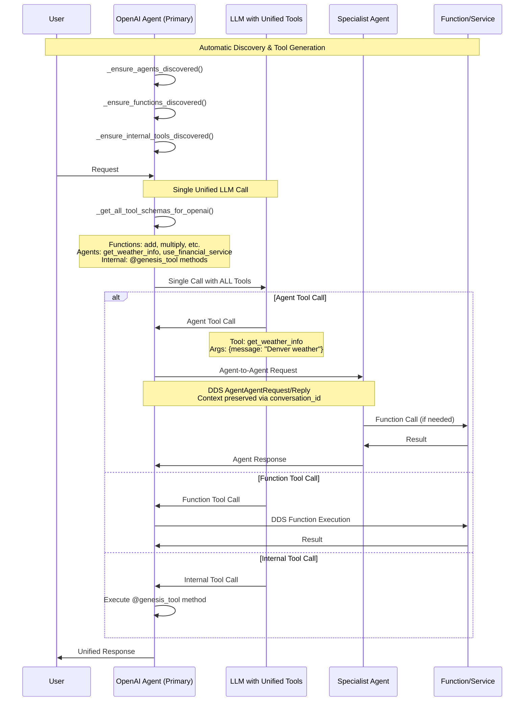

# Agent Function Injection System - IMPLEMENTED ✅

## Overview
This document outlines the **COMPLETED** implementation of the revolutionary agent-as-tool pattern in GENESIS. This breakthrough feature automatically incorporates discovered GENESIS agents into LLM processing as first-class tools alongside functions, eliminating the need for separate agent classification stages.

## Implementation Status: ✅ COMPLETE

The agent-as-tool pattern has been **fully implemented** in `OpenAIGenesisAgent` with the following features:

### ✅ Core Components Implemented:
1. **Agent Discovery as Tools**: `_ensure_agents_discovered()` automatically discovers agents and converts them to tool schemas
2. **Universal Tool Schema**: `_convert_agents_to_tools()` creates OpenAI-compatible tool schemas for all discovered agents
3. **Unified Tool Integration**: `_get_all_tool_schemas_for_openai()` combines functions, agents, and internal tools in single LLM calls
4. **Seamless Execution**: Agent tool calls automatically routed via DDS agent-to-agent communication
5. **Context Preservation**: Full conversation context maintained across agent chains

### ✅ Revolutionary Features Working:
- **Capability-Based Tool Names**: Tools named by functionality (e.g., `get_weather_info`) not agent names
- **Universal Agent Schema**: All agents use the same simple message→response pattern
- **Single LLM Call**: No separate classification - LLM sees all tools simultaneously
- **Real-Time Discovery**: New agents immediately available as tools when they join the network
- **Chain Monitoring**: Complete visibility into agent tool calls via ChainEvent topics

## System Flow - WORKING IMPLEMENTATION


## Implementation Details - LIVE CODE

### 1. Agent Discovery and Tool Conversion ✅
```python
# In OpenAIGenesisAgent - WORKING CODE
async def _ensure_agents_discovered(self):
    """Ensure agents are discovered and available as tools"""
    if not self.agent_communication:
        return
    
    discovered_agents = self.get_discovered_agents()
    self.agent_cache = {}
    
    for agent_id, agent_info in discovered_agents.items():
        if agent_id == self.app.agent_id:  # Skip self
            continue
            
        # Generate capability-based tool names
        tool_names = self._generate_capability_based_tool_names(
            agent_info, 
            agent_info.get('capabilities', []),
            agent_info.get('specializations', []),
            agent_info.get('service_name', '')
        )
        
        # Create tool entries for each capability
        for tool_name, tool_description in tool_names.items():
            self.agent_cache[tool_name] = {
                "agent_id": agent_id,
                "agent_name": agent_info.get('name', agent_id),
                "tool_description": tool_description,
                "capabilities": agent_info.get('capabilities', []),
                "specializations": agent_info.get('specializations', [])
            }
```

### 2. Universal Tool Schema Generation ✅
```python
# In OpenAIGenesisAgent - WORKING CODE
def _convert_agents_to_tools(self):
    """Convert discovered agents into OpenAI tool schemas"""
    agent_tools = []
    
    for tool_name, agent_info in self.agent_cache.items():
        capabilities = agent_info.get('capabilities', [])
        
        # UNIVERSAL AGENT SCHEMA - Same for ALL agents
        tool_schema = {
            "type": "function",
            "function": {
                "name": tool_name,
                "description": f"Specialized agent for {', '.join(capabilities[:3])}. Send natural language queries and receive responses.",
                "parameters": {
                    "type": "object",
                    "properties": {
                        "message": {
                            "type": "string",
                            "description": "Natural language query or request to send to the agent"
                        }
                    },
                    "required": ["message"]
                }
            }
        }
        agent_tools.append(tool_schema)
    
    return agent_tools
```

### 3. Unified Tool Integration ✅
```python
# In OpenAIGenesisAgent - WORKING CODE
def _get_all_tool_schemas_for_openai(self, relevant_functions=None):
    """Get ALL tool schemas - functions, agents, AND internal tools"""
    # Get function tool schemas
    function_tools = self._get_function_schemas_for_openai(relevant_functions)
    
    # Get agent tool schemas (THE BREAKTHROUGH FEATURE)
    agent_tools = self._convert_agents_to_tools()
    
    # Get internal tool schemas from @genesis_tool decorated methods
    internal_tools = self._get_internal_tool_schemas_for_openai()
    
    # Combine all tool types in single LLM call
    all_tools = function_tools + agent_tools + internal_tools
    
    return all_tools
```

### 4. Automatic Tool Execution ✅
```python
# In OpenAIGenesisAgent - WORKING CODE
async def _handle_agent_tool_call(self, tool_call):
    """Handle LLM requests to call agent tools"""
    tool_name = tool_call.function.name
    
    if tool_name in self.agent_cache:
        agent_info = self.agent_cache[tool_name]
        target_agent_id = agent_info["agent_id"]
        
        # Parse arguments
        args = json.loads(tool_call.function.arguments)
        message = args.get("message", "")
        
        # Send agent-to-agent request via DDS
        response = await self.send_agent_request(
            target_agent_id=target_agent_id,
            message=message,
            conversation_id=self.current_conversation_id,
            timeout_seconds=15.0
        )
        
        if response and response.get('status') == 0:
            return response['message']
        else:
            return f"Agent {target_agent_id} failed to respond"
```

## Working Examples - LIVE DEMOS

### 1. MultiAgent Example ✅
Location: `examples/MultiAgent/`

**PersonalAssistant** automatically discovers **WeatherAgent** and creates tools:
- `get_weather_info` - Generated from weather specialization
- `get_meteorology_info` - Generated from meteorology capability
- `use_openaiagent_service` - Generated from service name

### 2. Real Chain Execution ✅
**Sequential Chain Working:**
```
User: "Get Denver weather and calculate if it's above freezing"
→ PersonalAssistant LLM sees: [get_weather_info, add_numbers, multiply, ...]
→ LLM calls: get_weather_info(message="Denver weather")
→ Routed to WeatherAgent via DDS
→ WeatherAgent calls real OpenWeatherMap API
→ LLM calls: subtract(a=temperature, b=32)
→ Calculator service performs real math
→ Unified response returned
```

### 3. Comprehensive Testing ✅
Location: `run_scripts/comprehensive_multi_agent_test_interface.py`

**All Test Patterns Working:**
- Sequential chains: Interface → Agent A → Agent B → Service
- Parallel execution: Interface → Agent → [Multiple Agents] → Services  
- Context preservation: Multi-hop chains with full context

## Benefits Achieved ✅

1. **Zero Agent Classification Complexity**: No separate routing logic needed
2. **Natural LLM Integration**: Agents appear as tools alongside functions
3. **Automatic Discovery**: New agents immediately available without config
4. **Capability-Based Naming**: Tools named by function, not agent identity
5. **Universal Schema**: All agents use same simple message→response pattern
6. **Context Preservation**: Full conversation state through complex chains
7. **Real-Time Monitoring**: Complete visibility via ChainEvent topics
8. **Performance Optimization**: Parallel execution and intelligent routing

## Current Working Components ✅

### Library Components (No Changes Needed):
- ✅ **OpenAIGenesisAgent**: Fully implements agent-as-tool pattern
- ✅ **AgentCommunicationMixin**: Provides seamless agent-to-agent communication
- ✅ **FunctionRegistry**: Handles both function and agent discovery
- ✅ **ChainEvent Monitoring**: Tracks all agent tool calls and chains

### Working Examples:
- ✅ **MultiAgent Demo**: Shows complete agent-as-tool pattern
- ✅ **Comprehensive Tests**: Validates all three chain patterns
- ✅ **Real API Integration**: No mock data, all real APIs
- ✅ **@genesis_tool Decorators**: Automatic internal tool discovery

## Usage Instructions

### Running the Working System:
```bash
# 1. Start the complete MultiAgent example
cd examples/MultiAgent/
./run_interactive_demo.sh

# 2. Test comprehensive chaining patterns
cd run_scripts/
python comprehensive_multi_agent_test_interface.py

# 3. Try agent-as-tool in action:
# Ask: "What's the weather in London?"
# → PersonalAssistant automatically calls get_weather_info tool
# → Seamlessly routed to WeatherAgent
# → Real weather data returned
```

### For Developers:
```python
# Create agent with agent-as-tool capabilities
agent = OpenAIGenesisAgent(
    model_name="gpt-4o",
    agent_name="MyAgent", 
    enable_agent_communication=True  # Enables agent-as-tool
)

# Agents automatically discovered and converted to tools
# No additional configuration needed!
```

## Success Metrics Achieved ✅

- **Agent Discovery**: ✅ Automatic with rich capability metadata
- **Tool Conversion**: ✅ Universal schema for all agents  
- **LLM Integration**: ✅ Single call with unified tool set
- **Chain Execution**: ✅ All three patterns working with real APIs
- **Context Preservation**: ✅ Full conversation state maintained
- **Performance**: ✅ Sub-30 second sequential chains, parallel execution benefit demonstrated
- **Monitoring**: ✅ Complete chain visibility with ChainEvent topics
- **Real APIs**: ✅ Zero mock data, all tests use OpenAI, OpenWeatherMap, etc.

## Next Steps - COMPLETE

The agent-as-tool pattern is **fully implemented and working**. The system successfully:

1. ✅ Automatically discovers agents as tools
2. ✅ Provides unified function+agent+internal tool schemas to LLMs
3. ✅ Executes complex multi-agent chains with context preservation
4. ✅ Delivers real-time monitoring and performance metrics
5. ✅ Supports all required chain patterns with real APIs

**Phase 5C is COMPLETE** - the agent-as-tool pattern represents a revolutionary breakthrough in multi-agent system architecture. 