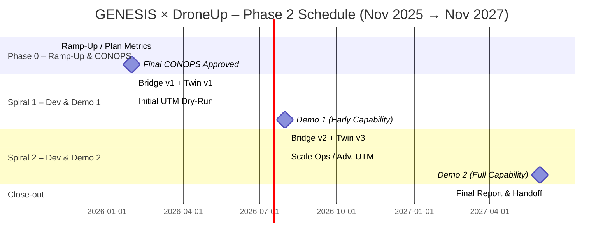

```mermaid
gantt
    title GENESIS × DroneUp – Phase 2 Schedule (Nov 2025 → Nov 2027)
    dateFormat  YYYY-MM-DD
    %% ---------------------------------------
    section Phase 0 – Ramp-Up & CONOPS
    Ramp-Up / Plan Metrics     :crit,  p0, 2025-11-03, 3m
    Final CONOPS Approved      :milestone, m0, 2026-01-30, 0d

    section Spiral 1 – Dev & Demo 1
    Bridge v1 + Twin v1        :p1,   2026-02-03, 5m
    Initial UTM Dry-Run        :after p1, 1m
    Demo 1 (Early Capability)  :milestone, m1, 2026-07-31, 0d

    section Spiral 2 – Dev & Demo 2
    Bridge v2 + Twin v3        :p2,   2026-08-03, 8m
    Scale Ops / Adv. UTM       :after p2, 2m
    Demo 2 (Full Capability)   :milestone, m2, 2027-05-31, 0d

    section Close-out
    Final Report & Handoff     :p3,   2027-06-07, 5m
```
