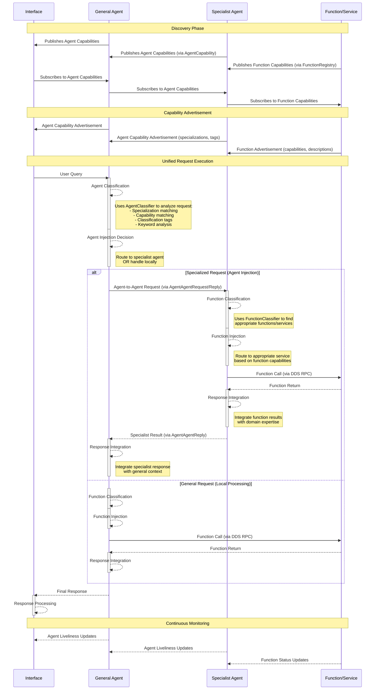

# GENESIS Function Call Flow

This document describes the unified flow of function calls and agent communication in the GENESIS distributed system.



## Flow Description

1. **Discovery Phase**
   - **Agent Discovery**: Agents publish their capabilities through `AgentCapability` DDS topic with rich metadata including specializations, classification tags, and performance metrics
   - **Function Discovery**: Functions/Services publish their capabilities through `FunctionRegistry` DDS topic
   - **Subscription**: Interface subscribes to agent capabilities, agents subscribe to both agent and function capabilities
   - **Registry**: Both agent and function metadata are maintained in distributed registries

2. **Capability Advertisement**
   - **Agent Capabilities**: Agents advertise specializations, capabilities, classification tags, model info, and default_capable status
   - **Function Capabilities**: Functions advertise descriptions, parameters, and domain-specific metadata
   - **Hierarchical Advertisement**: Capabilities flow up the chain to make specialized agents and functions discoverable

3. **Unified Request Execution**
   - Interface sends query to General Agent via DDS RPC
   - **Agent Classification**: General Agent uses `AgentClassifier` to analyze the request:
     - Exact capability matching
     - Specialization domain matching  
     - Classification tag matching
     - Keyword analysis
     - LLM-based semantic matching (optional)
   - **Routing Decision**: Agent injection vs local processing
   
   **Path A - Agent Injection (Specialized Requests):**
   - General Agent routes to Specialist Agent via `AgentAgentRequest`/`AgentAgentReply`
   - Specialist Agent performs function classification and injection
   - Specialist Agent calls appropriate functions/services
   - Results integrated with domain expertise and returned to General Agent
   
   **Path B - Local Processing (General Requests):**
   - General Agent performs function classification and injection directly
   - General Agent calls functions/services directly
   - Results integrated and returned to interface

4. **Response Integration**
   - Each agent integrates results with their domain knowledge and context
   - Routing metadata (explanations, agent IDs) preserved for transparency
   - Final unified response delivered to interface

5. **Continuous Monitoring**
   - Agent liveliness monitored through DDS and `AgentCapability` updates
   - Function status monitored through `FunctionRegistry` updates  
   - Real-time availability state maintained across the distributed system

## Agent Communication Patterns

The GENESIS system now supports unified agent communication and function calling patterns. The architecture provides both **Agent Injection** (agent-to-agent communication) and **Function Injection** (agent-to-function communication) using the same classification principles.

### Communication Patterns

1. **Direct Function Access**
```
Interface <-> General Agent <-> Function/Service
```
Used for simple function invocation where no specialized processing is needed.

2. **Agent Injection Pattern**
```
Interface <-> General Agent <-> Specialist Agent <-> Function/Service
```
Used when domain-specific knowledge or processing is required. The General Agent intelligently routes specialized requests to appropriate expert agents.

3. **Multi-Agent Collaboration**
```
Interface <-> General Agent <-> Specialist Agent A <-> Specialist Agent B <-> Function/Service
```
Used for complex workflows requiring multiple domains of expertise through agent-to-agent communication.

4. **Hybrid Function & Agent Injection**
```
Interface <-> General Agent [Agent Classifier] --> Weather Agent [Function Classifier] --> Weather Service
                           [Function Classifier] --> Calculator Service
```
General agents can route to both specialist agents AND functions based on request analysis.

### Unified Discovery Architecture

- **Agent Discovery**: Via `AgentCapability` topic with specializations, classification tags, and capabilities
- **Function Discovery**: Via `FunctionRegistry` topic with function descriptions and metadata
- **Dual Classification**: 
  - `AgentClassifier` for routing to appropriate agents
  - `FunctionClassifier` for routing to appropriate functions
- **Consistent Pattern**: Both use capability matching, keyword analysis, and domain classification

### Dynamic Routing Formation

**Agent Classification** considers:
- Request specialization requirements (weather, finance, health, etc.)
- Agent capability matching (exact capability names)
- Classification tag matching (keyword analysis)
- Agent availability and performance metrics
- Default capable agents as fallback

**Function Classification** considers:
- Function descriptions and parameters
- Domain-specific metadata
- Function availability and status
- Performance characteristics

### Routing Decision Tree

```
User Request → General Agent
    ↓
[Agent Classifier Analysis]
    ↓
Specialized Request? 
    ├─ YES → Route to Specialist Agent → [Function Classifier] → Function/Service
    └─ NO  → [Function Classifier] → Function/Service (local)
```

This creates a **fractal architecture** where the same classification and routing patterns apply at both the agent level and function level, enabling sophisticated multi-layer delegation and specialization.

## Implementation Details

The unified flow is implemented through several key components:

### Core Infrastructure
- `GenesisApp`: Base class providing DDS infrastructure for both agents and functions
- `GenesisAgent`: Enhanced base agent class with optional agent communication capabilities
- `AgentCommunicationMixin`: Provides agent-to-agent communication functionality

### Discovery and Classification Systems
- `FunctionRegistry`: Handles function registration and discovery via DDS
- `AgentClassifier`: Intelligent routing system for agent-to-agent communication
  - Specialization matching
  - Capability analysis  
  - Classification tag matching
  - Keyword domain analysis
- `FunctionClassifier`: Classifies and routes function requests
- `FunctionMatcher`: Matches function requests to available functions

### Communication Types
- `AgentAgentRequest`/`AgentAgentReply`: DDS types for agent-to-agent communication
- `InterfaceAgentRequest`/`InterfaceAgentReply`: DDS types for interface-to-agent communication
- `AgentCapability`: Enhanced capability advertisement with rich metadata

### Agent Types  
- **General Agents**: Can handle general requests and intelligently route specialized requests
- **Specialist Agents**: Domain experts that handle specific types of requests
- **Monitored Agents**: Include monitoring and observability for agent interactions

For more details, see the implementation in:
- `genesis_lib/genesis_app.py` - Core DDS infrastructure
- `genesis_lib/agent.py` - Enhanced agent base classes
- `genesis_lib/agent_communication.py` - Agent-to-agent communication
- `genesis_lib/agent_classifier.py` - Intelligent routing system
- `genesis_lib/function_classification.py` - Function routing system
- `test_functions/` - Example functions and agent tests
- `docs/agent_to_agent_communication.md` - Detailed architecture documentation 