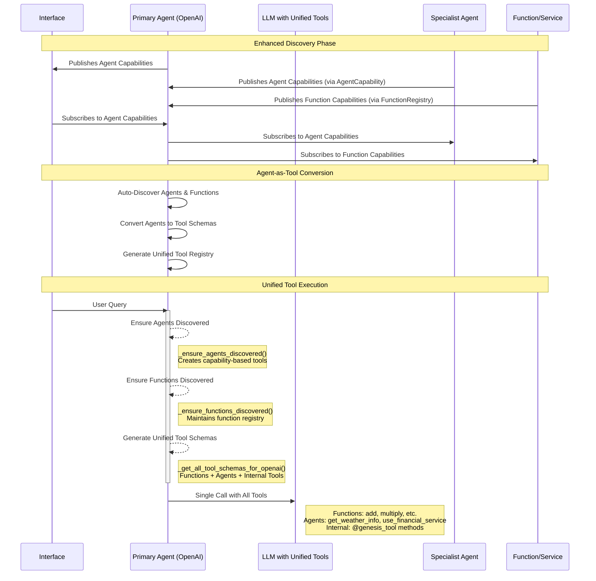

# Genesis API Overview: Agents, Interfaces, and Tools

## Introduction

**Genesis** is a distributed, LLM-agnostic AI framework that unifies agents, services, and tools into a self-organizing, discoverable ecosystem. It leverages RTI Connext DDS for real-time, reliable, and scalable communication, enabling seamless multi-agent workflows, dynamic discovery, and robust monitoring.

This document provides a high-level API and architectural overview for:
- **Agents**
- **Interfaces**
- **Tools** (including services and local/internal tools)
- **Communication and Data Model**
- **Discovery and Injection**

The goal is to equip developers and LLMs with enough context to accurately describe, plan, and extend Genesis-based systems and demos.

---

## 1. Core Concepts and Building Blocks

| Component      | Description                                                                                 |
|---------------|---------------------------------------------------------------------------------------------|
| **Agent**     | Stateful actor with memory/context, exposes high-level capabilities via RPC.                 |
| **Service**   | Stateless/lightly stateful function provider, exposes callable functions (tools).           |
| **Interface** | User-facing entry point (CLI, web UI, API gateway), forwards requests to agents.            |
| **Tool**      | Any callable function, agent, or method exposed to LLMs and other agents.                   |
| **DDS**       | RTI Connext DDS provides zero-config discovery, pub/sub, RPC, QoS, and optional security.   |

### 1.1 Agents
- Inherit from `GenesisAgent`, `MonitoredAgent`, or `OpenAIGenesisAgent`.
- Maintain working memory and conversation context.
- Can delegate to other agents or call services.
- Advertise capabilities via `AgentCapability` (specializations, tags, performance, etc.).
- Support agent-to-agent communication (see below).

### 1.2 Services (Function Providers)
- Inherit from `EnhancedServiceBase` or `GenesisRPCService`.
- Expose functions (e.g., `add_numbers`) as network-callable tools.
- Publish `FunctionCapability` (name, description, parameter schema, etc.).
- Functions are discoverable and callable by agents and LLMs.

### 1.3 Interfaces
- Inherit from `GenesisInterface` or `MonitoredInterface`.
- Discover available agents, send `InterfaceAgentRequest`, receive `InterfaceAgentReply`.
- Provide user entry points (CLI, web, API).

### 1.4 Tools
- **Local Tools**: Methods decorated with `@genesis_tool` inside agents; instantly available as tools.
- **Distributed Tools**: Functions/services registered on the Genesis network; discoverable and callable by any agent.
- All tools (local, distributed, agent) are converted to OpenAI-compatible tool schemas and injected into LLM calls.

---

## 2. Communication Model & Data Structures

Genesis uses RTI Connext DDS for all communication, discovery, and monitoring. Key data structures (defined in XML and Python) include:

### 2.1 Agent and Function Discovery
- **AgentCapability**: Advertises agent's name, description, type, service name, capabilities, specializations, tags, model info, and performance metrics.
- **FunctionCapability**: Advertises function's name, description, provider, parameter schema (JSON Schema), capabilities, metrics, and service name.

### 2.2 Request/Reply Types
- **InterfaceAgentRequest / InterfaceAgentReply**: Used for interface-to-agent communication. Contains `message` (string), `conversation_id` (string), and `status` (int for replies).
- **AgentAgentRequest / AgentAgentReply**: Used for agent-to-agent communication. Same structure as above.
- **FunctionExecutionRequest / FunctionExecutionReply**: Used for function/service calls. Contains function ID, parameters (JSON), result, status, error message, and metadata.

### 2.3 Monitoring Events
- **ComponentLifecycleEvent**: Tracks component state changes (start, stop, discovery, etc.).
- **ChainEvent**: Tracks the flow of a user query through the agent/function chain.
- **LogMessage**: Standardized logging structure for distributed monitoring.

#### Example: Agent-to-Agent Request (IDL)
```xml
<struct name="AgentAgentRequest">
  <member name="message" type="string" stringMaxLength="8192"/>
  <member name="conversation_id" type="string" stringMaxLength="128"/>
</struct>
```

---

## 3. Discovery and Injection

### 3.1 Automatic Discovery
- **DDS** provides zero-configuration discovery of all participants (agents, services, interfaces).
- Agents and services publish their capabilities on dedicated DDS topics (`AgentCapability`, `FunctionCapability`).
- New agents/services are immediately discoverable and available as tools.

### 3.2 Tool Injection (Agent-as-Tool Pattern)
- All discovered agents and functions are converted to OpenAI tool schemas and injected into LLM calls.
- Example tool schema for an agent:
```json
{
  "type": "function",
  "function": {
    "name": "get_weather_info",
    "description": "Specialized agent for weather, meteorology, climate. Send natural language queries and receive responses.",
    "parameters": {
      "type": "object",
      "properties": {
        "message": {
          "type": "string",
          "description": "Natural language query or request to send to the agent"
        }
      },
      "required": ["message"]
    }
  }
}
```
- LLMs see all tools (functions, agents, internal) in a single call, enabling unified reasoning and planning.
- Lightweight LLM-based classifiers filter and rank tools to avoid overwhelming the model.

---

## 4. Communication Flow

### 4.1 Sequence Diagram (Agent-as-Tool)


---

## 5. Example: Adding Tools and Agents

### 5.1 Local Tool Example
```python
from genesis_lib.openai_genesis_agent import OpenAIGenesisAgent
from genesis_lib.decorators import genesis_tool

class CalculatorAgent(OpenAIGenesisAgent):
    @genesis_tool
    async def add(self, a: int, b: int) -> int:
        """Add two numbers and return the result."""
        return a + b

    async def on_start(self):
        print("CalculatorAgent is running and ready!")
```
- The `@genesis_tool` decorator exposes the method as a tool to the LLM and other agents.
- Tools are automatically discoverable and callable via natural language or programmatically.

### 5.2 Distributed Service Example
```python
from genesis_lib.rpc_service import GenesisRPCService
from genesis_lib.decorators import genesis_tool

class CalculatorService(GenesisRPCService):
    @genesis_tool
    async def add(self, a: int, b: int) -> int:
        """Add two numbers and return the result."""
        return a + b

if __name__ == "__main__":
    import asyncio
    asyncio.run(CalculatorService().run())
```
- This service runs independently and registers its `add` tool on the Genesis network.
- Any agent can discover and invoke this tool, regardless of where the service is running.

---

## 6. Monitoring and Observability
- Every agent, service, and interface emits monitoring events (lifecycle, chain, log).
- The monitoring system can replay chains, visualize the network, and provide root-cause analysis.
- Monitoring topics: `ComponentLifecycleEvent`, `ChainEvent`, `LogMessage`.

---

## 7. Security and Performance
- **Authentication**: DDS participant GUIDs identify all components.
- **Authorization**: (Planned) DDS Security for fine-grained access control.
- **Encryption**: (Planned) DDS Security for encrypted channels.
- **Performance**: Connection pooling, lazy connection, batching, and real-time monitoring.

---

## 8. Summary: Key Genesis Advantages
- **Unified Tool Ecosystem**: Agents, services, and internal tools are all first-class, discoverable, and callable.
- **Automatic Discovery**: Zero-config, real-time discovery of all components.
- **Agent-as-Tool Pattern**: All agents become tools, enabling powerful LLM-driven workflows.
- **Robust Communication**: Industrial-grade DDS transport for reliability and scalability.
- **Comprehensive Monitoring**: Full visibility into multi-agent workflows and system health.

---

## 9. Further Reading and Examples
- See `examples/MultiAgent/` for a complete demo.
- See `docs/guides/function_call_flow.md`, `docs/business/proposals/genesis_overview_report.md`, and `docs/agents/agent_to_agent_communication.md` for deeper dives.
- For advanced monitoring, see `docs/planning/unified_monitoring_system_plan.md`. 
