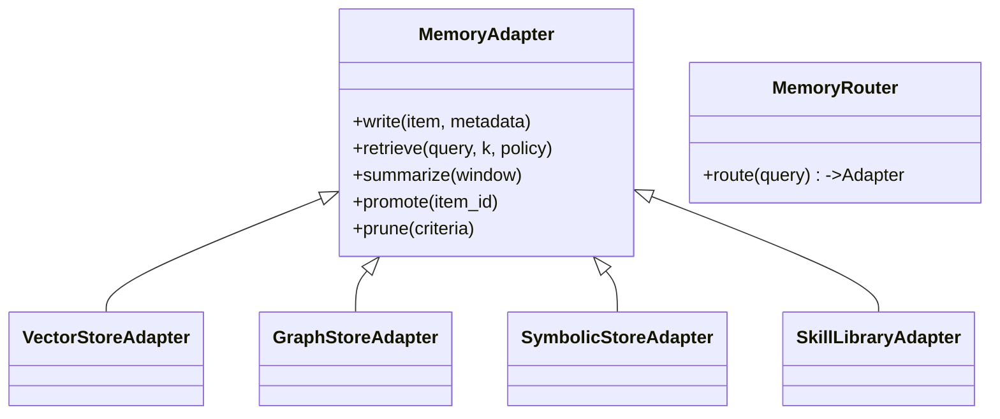

What aspect of Genesis are you deep‑diving this week, and where could a memory‑systems specialist be most helpful—API design, persistence layer choice, evaluation, security, or something else?
(Feel free to note any hard constraints such as air‑gapped deployment, classified data, mobile footprint, etc.)

---

Below is a **practical landscape review** of the strongest external‑memory designs for large‑language‑model agents as of mid‑2025, plus an implementation blueprint showing how to make them *pluggable* in Genesis. Citations are embedded so you can jump directly to the papers or code bases.

---

## 1. Why external memory still matters

* 128‑2048 k‑token context windows solve *recency* but not **continuity**—the minute you roll the context forward, details fall out and hallucinations re‑appear.
* Long‑context architectures (e.g., Recurrent Memory Transformer up to 2 M tokens) are GPU‑hungry and still cannot *search* past events efficiently ([arxiv.org][1], [ojs.aaai.org][2]).
* A durable memory layer lets agents **write once, read many** with task‑specific retrieval policies, off‑loading both compute and token budget.

---

## 2. Core design dimensions

| Dimension            | Choices                                                              | Design hint for Genesis                                                             |
| -------------------- | -------------------------------------------------------------------- | ----------------------------------------------------------------------------------- |
| **Granularity**      | message, thought, action, file chunk, symbolic state                 | Store at the smallest unit that can be *directly* reused without regeneration.      |
| **Memory type**      | working, episodic, semantic, procedural/skill                        | Keep separate stores and merging policies; don’t mix in one vector DB.              |
| **Indexing**         | dense vector, sparse/BM25, graph, key–value, symbolic constraints    | Selectable per store; expose as `MemoryAdapter` capability flags.                   |
| **Retrieval policy** | similarity, recency, entity‑linked, task‑conditioned, planner‑hinted | Make retrieval *query‑aware* (pass tool, role, plan step).                          |
| **Lifecycle**        | streaming, snapshot, archive                                         | Provide explicit `promote()`/`prune()` hooks so an agent can reflect and summarise. |

---

## 3. Proven external‑memory architectures

| Architecture                                    | Best for                                  | Key ideas                                                                                     | Representative work                                                                                         |
| ----------------------------------------------- | ----------------------------------------- | --------------------------------------------------------------------------------------------- | ----------------------------------------------------------------------------------------------------------- |
| **MemGPT‑style paging**                         | “infinite chat”, personal assistant       | OS‑like *paging*: main‑prompt (RAM) vs. disk; agent issues `read_page`, `write_page` calls    | MemGPT deep dives ([getfocal.co][3], [medium.com][4])                                                       |
| **Hierarchical retrieval trees**                | long conversations & multi‑topic projects | HAT tree aggregates context → logarithmic traversal to surface most‑relevant branch           | HAT memory ([arxiv.org][5])                                                                                 |
| **Hierarchical‑Categorical Memory (HMR / EHC)** | continual learning agents                 | Combines coarse category filter ➜ fine vector retrieval ➜ on‑the‑fly episodic write‑back      | EHC agent ([arxiv.org][6])                                                                                  |
| **Recurrent Memory Transformer (RMT)**          | single‑document QA up to M‑tokens         | Adds learned memory tokens passed between segments (internal, not external)                   | RMT & follow‑ups ([arxiv.org][1], [medium.com][7])                                                          |
| **Episodic memory stores**                      | task/mission continuity, self‑reflection  | Time‑stamped “episodes” summarised & entity‑linked; can answer “when did I …?”                | Episodic‑memory position paper ([arxiv.org][8])                                                             |
| **Skill/Procedural libraries**                  | code‑generating or tool‑using agents      | Store generated skills/tests as callable snippets; retrieval keyed by task graph              | Voyager skill library ([arxiv.org][9], [voyager.minedojo.org][10])                                          |
| **Symbolic working memory / neurosymbolic**     | multi‑step reasoning, verifiable output   | Parallel store holds logical forms/constraints; LLM calls SAT/SMT or executes symbolic traces | Symbolic working memory ([arxiv.org][11], [arxiv.org][12]) ; LLM‑based symbolic execution ([arxiv.org][13]) |
| **Memory‑router frameworks**                    | heterogeneous data, quick prototyping     | Runtime chooses Vector / Graph / SQL / Tool; example: LlamaIndex memory revamp                | LlamaIndex changelog ([docs.llamaindex.ai][14])                                                             |

---

## 4. Symbolic‑execution‑aware memory

1. **Path‑state cache** – Capture \<path‑constraint, observation, result>.
2. **Constraint store** – Index each symbolic variable in a key–value store; retrieval by aliasing / morphological similarity.
3. **Replay & refinement** – Allow the agent to *re‑execute* a past symbolic path under new parameters, skipping costly solving.
4. **Safety** – Keep symbolic traces separate from natural‑language memories; they grow fast and rarely need embedding.

Papers to bookmark: LLM‑based Symbolic Execution ([arxiv.org][13]); Neuro‑symbolic review ([arxiv.org][15]).

---

## 5. Blueprint: *PluggableMemory* subsystem for Genesis



### Implementation tips

* **Metadata schema**

  ```json
  {
    "type": "episodic" | "semantic" | "skill" | "symbolic",
    "timestamp": "...",
    "entities": ["GENESIS", "DDS", "sensor_X"],
    "embedding": [ ... ],
    "source": "agent://planner" | "user://chat" | ...
  }
  ```

* **Routing** – Example policy:

  ```python
  if query.intent == "prove" or query.requires == "symbolic":
      return SymbolicStore
  elif query.intent == "execute_skill":
      return SkillLibrary
  elif len(query.text) > 800:
      return GraphStore
  else:
      return VectorStore
  ```

* **Memory lifecycle hooks**

  * `on_turn_end`: write working memory to episodic store.
  * `on_task_complete`: summarise and promote key events to semantic store.
  * `on_idle`: archive low‑frequency items.

* **Security / multi‑tenant** – Namespaces + zero‑copy snapshotting (think ZFS) to keep classified contexts isolated while still sharable via *capability tokens*.

---

## 6. Choosing the right architecture on the fly

| Situation                               | Recommended memory stack                                                              |
| --------------------------------------- | ------------------------------------------------------------------------------------- |
| **Conversational assistant**            | MemGPT paging + episodic vector store                                                 |
| **Code‑generation agent**               | SkillLibraryAdapter (vector) + SymbolicStoreAdapter                                   |
| **Simulation control (DDS, real‑time)** | HMR tree for fast retrieval + short sliding window; store only *state deltas*         |
| **Long‑running research project**       | Episodic DB ➜ nightly semantic summarisation ➜ graph store; maintain provenance links |
| **Formal verification / compliance**    | SymbolicStoreAdapter with SMT backend; log every inference for audit                  |

---

## 7. Measuring success

* **Retrieval precision\@k** on canonical queries (unit tests).
* **Context hit‑rate**: fraction of retrieved chunks actually used by the LLM (use attention‑weight heuristics).
* **Latency budget**: ≤ 150 ms for single retrieval in interactive mode; relax in batch.
* **Coherence score**: automatic rubric from MemGPT evaluations or custom LlamaIndex evaluator hooks.

---

## 8. Next steps for Genesis

1. **Stub the `MemoryAdapter` interface** (above) and implement a minimal vector‑store version (e.g., PGVector or Qdrant).
2. **Integrate a `MemoryRouter`** to exercise policy logic—even with only one backend for now.
3. **Add symbolic prototype**: start with JSON‑encoded Z3 constraints; store/read via the same adapter interface.
4. **Continuous evaluation harness**: plug in LlamaIndex AIMon evaluators to track coherence drift over multi‑day runs.
5. **Iterate**: measure bottlenecks, then layer in HAT tree or paging if turn cost > token cost.

---

### Bottom line

*There is no single “best” memory—only the right combination for the current task.* By modularising Genesis around **adapters + router**, you can swap in MemGPT‑style paging for chat, a symbolic store for proofs, or a skill library for code reuse—*without touching agent logic*. The cited architectures above give you the blueprints; the table under §6 tells you when to activate each one.

Let me know which of these areas you want to prototype first or if you’d like code examples for a specific adapter.

[1]: https://arxiv.org/abs/2304.11062?utm_source=chatgpt.com "Scaling Transformer to 1M tokens and beyond with RMT - arXiv"
[2]: https://ojs.aaai.org/index.php/AAAI/article/view/29722/31239?utm_source=chatgpt.com "[PDF] Breaking the Limits of Transformer Context Length with Recurrent ..."
[3]: https://www.getfocal.co/post/unlocking-the-potential-of-language-models-with-memgpt-a-deep-dive?utm_source=chatgpt.com "MemGPT: A Deep Dive - Focal"
[4]: https://medium.com/ai-advances/smarter-ai-starts-with-memory-why-memgpt-matters-now-36d3cf86f0bb?utm_source=chatgpt.com "Smarter AI Starts With Memory: Why MemGPT Matters Now - Medium"
[5]: https://arxiv.org/html/2406.06124v1?utm_source=chatgpt.com "Enhancing Long-Term Memory using Hierarchical Aggregate Tree ..."
[6]: https://arxiv.org/html/2505.22006v1?utm_source=chatgpt.com "Efficiently Enhancing General Agents with Hierarchical-Categorical ..."
[7]: https://medium.com/%40ronnyh/research-paper-summary-recurrent-memory-mechanism-scaling-transformer-to-1m-tokens-and-beyond-b2039efb5904?utm_source=chatgpt.com "Scaling Transformer to 1M tokens and beyond | by Ronny H | Medium"
[8]: https://arxiv.org/pdf/2502.06975?utm_source=chatgpt.com "[PDF] Episodic Memory is the Missing Piece for Long-Term LLM Agents"
[9]: https://arxiv.org/abs/2305.16291?utm_source=chatgpt.com "[2305.16291] Voyager: An Open-Ended Embodied Agent with Large ..."
[10]: https://voyager.minedojo.org/?utm_source=chatgpt.com "Voyager | An Open-Ended Embodied Agent with Large Language ..."
[11]: https://arxiv.org/html/2408.13654v1?utm_source=chatgpt.com "Symbolic Working Memory Enhances Language Models for ... - arXiv"
[12]: https://arxiv.org/abs/2408.13654?utm_source=chatgpt.com "Symbolic Working Memory Enhances Language Models for ... - arXiv"
[13]: https://arxiv.org/html/2505.13452v1?utm_source=chatgpt.com "Large Language Model powered Symbolic Execution - arXiv"
[14]: https://docs.llamaindex.ai/en/stable/CHANGELOG/?utm_source=chatgpt.com "Changelog - LlamaIndex"
[15]: https://arxiv.org/html/2501.05435v1?utm_source=chatgpt.com "Neuro-Symbolic AI in 2024: A Systematic Review - arXiv"
