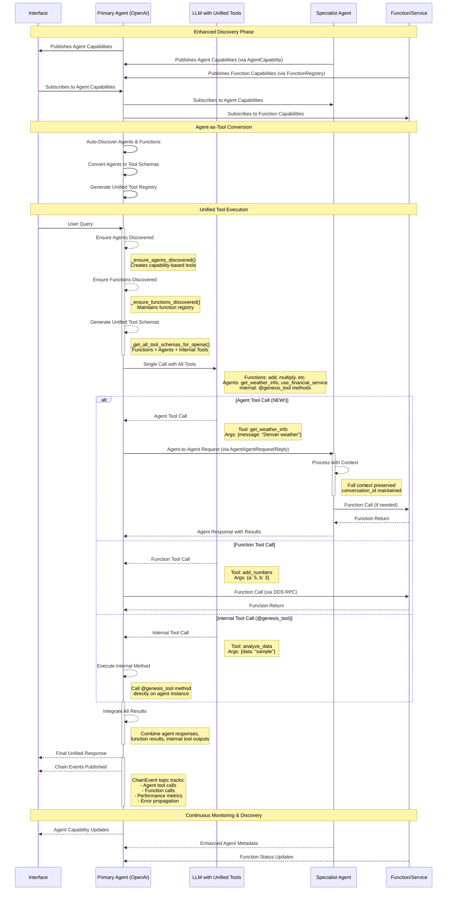

# GENESIS Function Call Flow - Agent-as-Tool Pattern

This document describes the revolutionary unified flow of function calls and agent communication in the GENESIS distributed system using the breakthrough **Agent-as-Tool** pattern.



## Revolutionary Agent-as-Tool Pattern

The GENESIS 2.0 breakthrough eliminates the complexity of agent classification by treating agents as **first-class tools** in LLM calls, alongside functions.

### Key Innovations:

1. **Universal Tool Schema:** All agents converted to OpenAI tools using the same universal pattern:
   ```json
   {
     "type": "function",
     "function": {
       "name": "get_weather_info",
       "description": "Specialized agent for weather, meteorology, climate. Send natural language queries and receive responses.",
       "parameters": {
         "type": "object", 
         "properties": {
           "message": {
             "type": "string",
             "description": "Natural language query or request to send to the agent"
           }
         },
         "required": ["message"]
       }
     }
   }
   ```

2. **Capability-Based Tool Names:** Tools named by what they do, not who they are:
   - `get_weather_info` (from WeatherAgent's weather specialization)
   - `use_financial_service` (from FinanceAgent's service name)
   - `get_health_info` (from HealthAgent's health specialization)

3. **Single LLM Call:** No separate classification step - LLM sees all tools at once:
   - **Functions:** `add_numbers`, `multiply`, `get_current_time`
   - **Agents:** `get_weather_info`, `use_financial_service`, `analyze_documents`
   - **Internal Tools:** `@genesis_tool` decorated methods

4. **Seamless Execution:** Agent tool calls automatically routed via DDS agent-to-agent communication

## Flow Description

### 1. Enhanced Discovery Phase
- **Agent Discovery**: Agents publish comprehensive capabilities through `AgentCapability` DDS topic with:
  - Specializations (weather, finance, health, etc.)
  - Capabilities (specific functions they can perform)
  - Classification tags (keywords for discoverability)
  - Performance metrics and availability status
- **Function Discovery**: Functions/Services publish capabilities through `FunctionCapability` DDS topic
- **Unified Registry**: Primary agents maintain both agent and function registries

### 2. Agent-as-Tool Conversion Phase
- **Automatic Discovery**: `_ensure_agents_discovered()` finds all available agents
- **Tool Schema Generation**: `_convert_agents_to_tools()` creates OpenAI tool schemas
- **Capability-Based Naming**: Tool names generated from agent specializations and capabilities
- **Unified Tool Registry**: Combined function + agent + internal tool schemas

### 3. Unified Tool Execution
- **Single LLM Call**: Primary agent calls LLM with all available tools
- **Intelligent Selection**: LLM selects appropriate tool based on query content
- **Automatic Routing**: 
  - Agent tools → DDS agent-to-agent communication
  - Function tools → DDS function execution
  - Internal tools → Direct method invocation

### 4. Context-Preserving Chain Execution
- **Context Preservation (scope clarified)**:
  - `conversation_id` is preserved on Interface↔Agent and Agent↔Agent RPC paths (defined in XML types).
  - Agent→Function calls (FunctionRequest/Reply) do not include `conversation_id`; correlation across function hops is via monitoring overlays (e.g., `ChainEvent` with `chain_id`/`call_id`).
- **Chain Monitoring**: Every interaction tracked via `ChainEvent` topics
- **Performance Metrics**: Latency and success rates measured for each hop
- **Error Propagation**: Graceful failure handling through multi-hop chains

## Comprehensive Chain Patterns Supported

The agent-as-tool pattern enables three critical chain types:

### 1. Sequential Agent Chain
```
Interface → Primary Agent → [LLM with Tools] → Specialist Agent → Service → Function
```
**Example**: "Get Denver weather and calculate temperature difference from freezing"
- LLM calls `get_weather_info` tool (routes to WeatherAgent)
- WeatherAgent gets real weather data
- LLM then calls `subtract` function for calculation

### 2. Parallel Agent Execution  
```
Interface → Primary Agent → [LLM with Tools] → [Agent A, Agent B, Agent C] → Services
```
**Example**: "Get weather for Denver, New York, and London, then average"
- LLM may request multiple agent tool calls in one turn.
- Current implementation executes tool calls sequentially; parallelization is feasible as an optimization.
- Results can be aggregated after all calls complete.

### 3. Context-Preserving Chain
```
Interface → Primary Agent → Agent A (context) → Agent B (context) → Service
```
**Example**: "Get weather → clothing recommendations → travel planning"
- Context flows through conversation_id
- Each agent builds on previous agent's results
- Full conversation state maintained

## Implementation Details

### Core Infrastructure Enhanced
- `OpenAIGenesisAgent`: Enhanced with agent-as-tool capabilities
- `AgentCommunicationMixin`: Provides seamless agent-to-agent communication  
- `AgentCapability`: Rich metadata for agent discovery and tool generation

### Discovery and Tool Systems
- `_ensure_agents_discovered()`: Automatic agent discovery and tool conversion
- `_convert_agents_to_tools()`: Universal schema generation for all agents
- `_get_all_tool_schemas_for_openai()`: Unified tool registry (functions + agents + internal)
- Enhanced `FunctionRegistry`: Maintains function advertisements and discovery cache
- Primary agent may shortlist functions via classifier; falls back to unified toolset when appropriate

### Communication Types  
- `AgentAgentRequest`/`AgentAgentReply`: Structured agent-to-agent communication
- `InterfaceAgentRequest`/`InterfaceAgentReply`: Interface-to-agent communication  
- `AgentCapability`: Enhanced capability advertisement with rich metadata
- `ChainEvent`: Real-time chain execution monitoring

### Agent Types
- **Primary Agents**: `OpenAIGenesisAgent` with agent-as-tool capabilities
- **Specialist Agents**: Domain experts discoverable as tools
- **Monitored Agents**: Include comprehensive monitoring and chain tracking

## Benefits of Agent-as-Tool Pattern

1. **Simplified Architecture**: No separate classification stage - single LLM call
2. **Better LLM Understanding**: Agents appear as tools with clear descriptions
3. **Unified Tool Ecosystem**: Functions and agents treated identically
4. **Automatic Discovery**: New agents immediately available as tools
5. **Context Preservation**: Full conversation state through complex chains
6. **Real-Time Monitoring**: Complete visibility into multi-agent workflows
7. **Performance Optimization**: Parallel execution and intelligent routing

For detailed implementation, see:
- `genesis_lib/openai_genesis_agent.py` - Agent-as-tool implementation
- `genesis_lib/agent_communication.py` - Agent-to-agent communication
- `examples/MultiAgent/` - Complete working demonstrations
- `run_scripts/comprehensive_multi_agent_test_interface.py` - Comprehensive testing 
